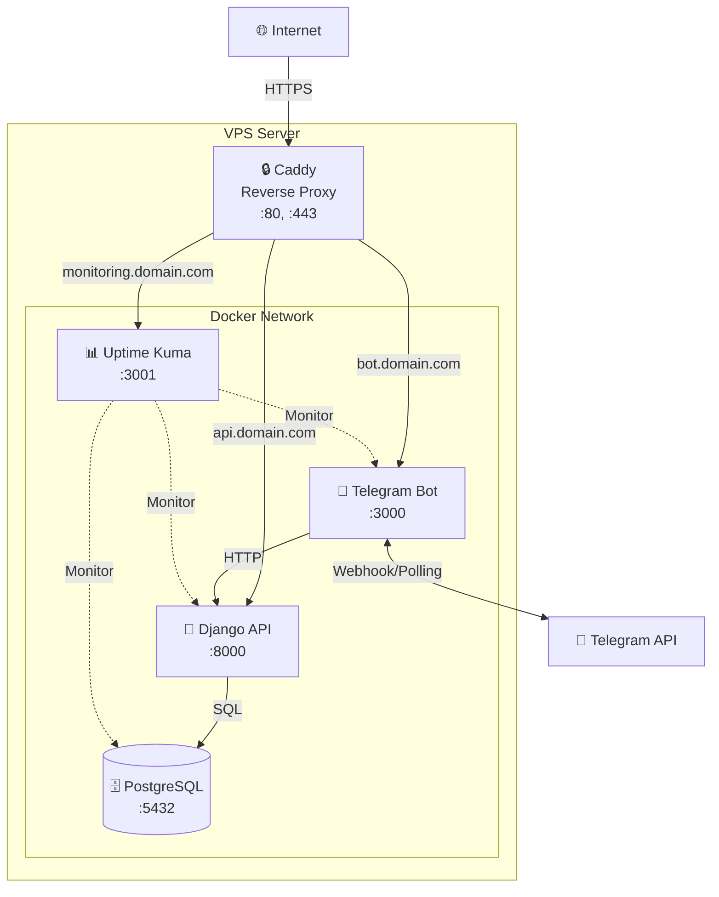
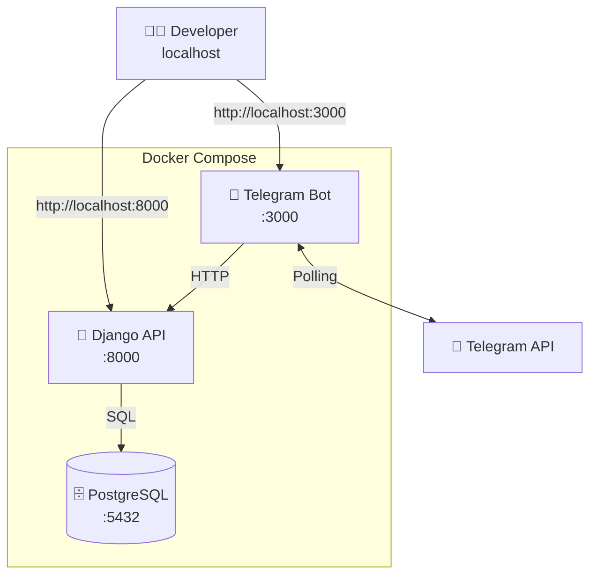
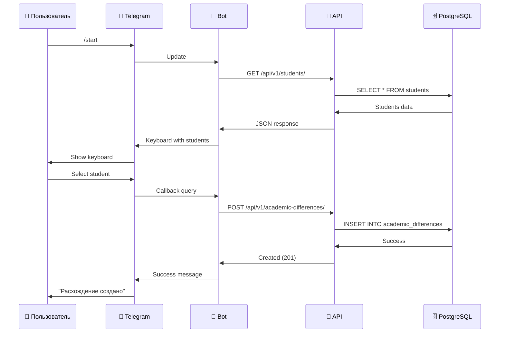
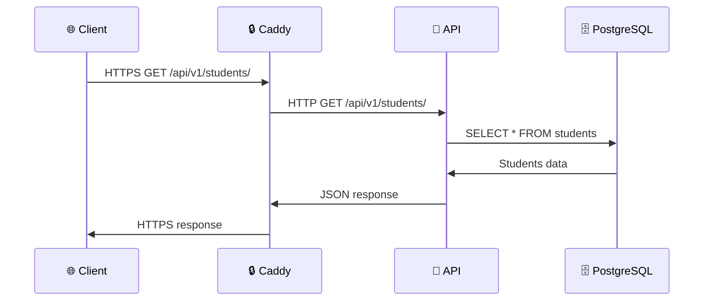
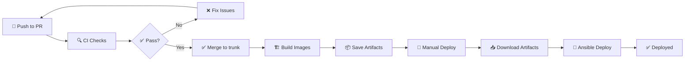
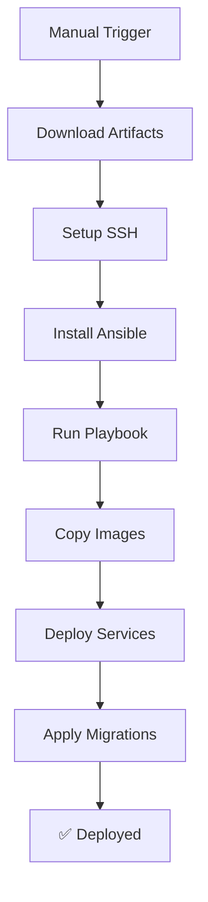
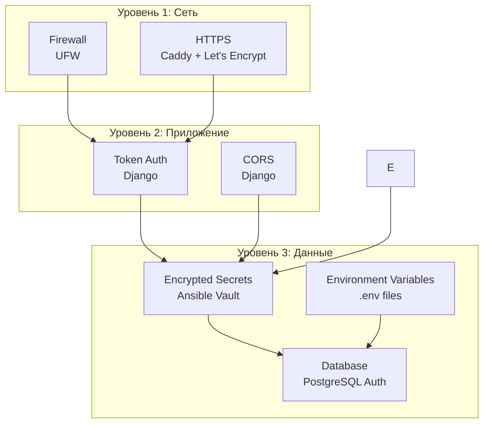

# 🏗️ Архитектура проекта

Подробное описание архитектуры системы Academic Differences API.

---

## 📋 Содержание

- [Обзор системы](#-обзор-системы)
- [Диаграмма компонентов](#-диаграмма-компонентов)
- [Описание сервисов](#-описание-сервисов)
- [Взаимодействие между сервисами](#-взаимодействие-между-сервисами)
- [Используемые порты](#-используемые-порты)
- [Переменные окружения](#-переменные-окружения)
- [Docker Compose конфигурация](#-docker-compose-конфигурация)
- [CI/CD Pipeline](#-cicd-pipeline)
- [Безопасность](#-безопасность)

---

## 🎯 Обзор системы

Academic Differences API - это микросервисная система для управления академическими расхождениями в учебных планах, состоящая из следующих компонентов:

- **Django REST API** - Backend API для управления данными
- **Telegram Bot** - Интерфейс для пользователей через Telegram
- **PostgreSQL** - Реляционная база данных
- **Caddy** - Reverse proxy с автоматическим HTTPS
- **Uptime Kuma** - Мониторинг доступности сервисов

---

## 📊 Диаграмма компонентов

### Production архитектура



### Development архитектура



---

## 🔧 Описание сервисов

### 1. Django REST API

**Назначение:** Backend API для управления данными

**Технологии:**

- Django 5.2
- Django REST Framework 3.16
- PostgreSQL (psycopg 3.2)
- Gunicorn (production)

**Основные функции:**

- ✅ CRUD операции для студентов, кафедр, предметов, расхождений
- ✅ Token аутентификация для бота
- ✅ Автоматическая документация (Swagger/ReDoc)
- ✅ История изменений (django-simple-history)
- ✅ Импорт/экспорт данных (django-import-export)
- ✅ Фильтрация и поиск

**Endpoints:**

- `/api/v1/students/` - Управление студентами
- `/api/v1/departments/` - Управление кафедрами
- `/api/v1/subjects/` - Управление предметами
- `/api/v1/academic-differences/` - Управление расхождениями
- `/api/v1/academic-difference-files/` - Файлы расхождений
- `/api/v1/schema/` - OpenAPI спецификация
- `/admin/` - Django Admin панель

**Конфигурация:**

- Файл: [`api/Dockerfile`](../api/Dockerfile)
- Настройки: [`api/core/settings.py`](../api/core/settings.py)
- Зависимости: [`api/requirements.txt`](../api/requirements.txt)

### 2. Telegram Bot

**Назначение:** Интерфейс для пользователей через Telegram

**Технологии:**

- TypeScript 5.9
- Telegraf 4.16
- Express 5.1 (healthcheck endpoint)
- Автогенерируемый API клиент

**Основные функции:**

- ✅ Интерактивное управление расхождениями
- ✅ Сцены для многошаговых операций
- ✅ Сессии пользователей
- ✅ Интеграция с Django API

**Конфигурация:**

- Файл: [`tgbot/Dockerfile`](../tgbot/Dockerfile)
- Главный файл: [`tgbot/src/main.ts`](../tgbot/src/main.ts)
- Зависимости: [`tgbot/package.json`](../tgbot/package.json)

### 3. PostgreSQL

**Назначение:** Реляционная база данных

**Технологии:**

- PostgreSQL 18 Alpine

**Основные функции:**

- ✅ Хранение всех данных приложения
- ✅ Транзакции и ACID гарантии
- ✅ Индексы для быстрого поиска
- ✅ Автоматические бэкапы через volumes

**Конфигурация:**

- Образ: `postgres:18-alpine`
- Volume: `postgres_data`
- Healthcheck: `pg_isready`

### 4. Caddy

**Назначение:** Reverse proxy с автоматическим HTTPS

**Технологии:**

- Caddy 2 Alpine

**Основные функции:**

- ✅ Автоматические SSL сертификаты (Let's Encrypt)
- ✅ HTTP/2 и HTTP/3 (QUIC) поддержка
- ✅ Gzip сжатие
- ✅ Раздача статических файлов Django
- ✅ Reverse proxy для всех сервисов

**Конфигурация:**

- Файл: [`infra/ansible/templates/Caddyfile.j2`](../infra/ansible/templates/Caddyfile.j2)
- Volumes: `caddy_data`, `caddy_config`, `staticfiles`

### 5. Uptime Kuma

**Назначение:** Мониторинг доступности сервисов

**Технологии:**

- Uptime Kuma 2

**Основные функции:**

- ✅ Мониторинг HTTP endpoints
- ✅ Мониторинг Docker контейнеров
- ✅ Уведомления (Telegram, Email, Slack, etc.)
- ✅ Статистика uptime
- ✅ Красивый dashboard

**Конфигурация:**

- Образ: `louislam/uptime-kuma:2`
- Volume: `uptime_kuma`
- Порт: 3001

---

## 🔄 Взаимодействие между сервисами

### Sequence диаграмма: Создание расхождения через бота



### Sequence диаграмма: HTTP запрос к API



### Взаимодействие сервисов

| От          | К            | Протокол | Назначение                  |
| ----------- | ------------ | -------- | --------------------------- |
| Internet    | Caddy        | HTTPS    | Внешние запросы             |
| Caddy       | API          | HTTP     | Проксирование к API         |
| Caddy       | Bot          | HTTP     | Проксирование к боту        |
| Caddy       | Uptime Kuma  | HTTP     | Проксирование к мониторингу |
| Bot         | API          | HTTP     | Запросы к API               |
| API         | PostgreSQL   | TCP      | Запросы к БД                |
| Bot         | Telegram API | HTTPS    | Webhook/Polling             |
| Uptime Kuma | API          | HTTP     | Healthcheck                 |
| Uptime Kuma | Bot          | HTTP     | Healthcheck                 |

⚠️ **Важно:** Ansible НЕ взаимодействует с сервисами напрямую. Ansible только разворачивает конфигурацию на сервере.

---

## 🔌 Используемые порты

### Development (localhost)

| Сервис           | Внутренний порт | Внешний порт | Доступ                |
| ---------------- | --------------- | ------------ | --------------------- |
| **PostgreSQL**   | 5432            | -            | Только внутри Docker  |
| **Django API**   | 8000            | 8000         | http://localhost:8000 |
| **Telegram Bot** | 3000            | 3000         | http://localhost:3000 |

### Production (VPS)

| Сервис           | Внутренний порт | Внешний порт     | Доступ               |
| ---------------- | --------------- | ---------------- | -------------------- |
| **Caddy**        | 80, 443         | 80, 443, 443/udp | Публичный            |
| **PostgreSQL**   | 5432            | -                | Только внутри Docker |
| **Django API**   | 8000            | -                | Через Caddy          |
| **Telegram Bot** | 3000            | -                | Через Caddy          |
| **Uptime Kuma**  | 3001            | -                | Через Caddy          |

### Схема портов

```
Production:
┌─────────────────────────────────────────┐
│ Internet                                │
└────────────┬────────────────────────────┘
             │ :80, :443, :443/udp
             ▼
┌─────────────────────────────────────────┐
│ Caddy                                   │
└─┬─────────┬─────────┬───────────────────┘
  │ :8000   │ :3000   │ :3001
  ▼         ▼         ▼
┌────┐   ┌────┐   ┌──────┐
│API │   │Bot │   │Kuma  │
└─┬──┘   └─┬──┘   └──────┘
  │ :5432  │
  ▼        │
┌────────┐ │
│Postgres│◄┘
└────────┘
```

---

## 🔐 Переменные окружения

### Development (.env)

| Переменная                      | Описание            | Пример                  |
| ------------------------------- | ------------------- | ----------------------- |
| `SECRET_KEY`                    | Django secret key   | `django-insecure-...`   |
| `DEBUG`                         | Режим отладки       | `True`                  |
| `ALLOWED_HOSTS`                 | Разрешенные хосты   | `127.0.0.1,localhost`   |
| `POSTGRES_USER`                 | Пользователь БД     | `academic_user_dev`     |
| `POSTGRES_DB`                   | Имя БД              | `academic_db_dev`       |
| `POSTGRES_PASSWORD`             | Пароль БД           | `academic_user_dev`     |
| `POSTGRES_HOST`                 | Хост БД             | `postgres`              |
| `POSTGRES_PORT`                 | Порт БД             | `5432`                  |
| `DJANGO_SUPERUSER_USERNAME`     | Админ логин         | `root`                  |
| `DJANGO_SUPERUSER_PASSWORD`     | Админ пароль        | `root`                  |
| `TELEGRAM_BOT_TOKEN`            | Токен Telegram бота | `123456:ABC-DEF...`     |
| `DJANGO_TELEGRAM_BOT_USERNAME`  | Логин бота в API    | `tgbot`                 |
| `DJANGO_TELEGRAM_BOT_PASSWORD`  | Пароль бота в API   | `tgbot`                 |
| `DJANGO_TELEGRAM_BOT_API_TOKEN` | API токен для бота  | `tgbot`                 |
| `BOT_API_BASE_URL`              | URL API для бота    | `http://localhost:8000` |

### Production (Ansible Vault)

Все production переменные хранятся в зашифрованном [`infra/ansible/vars/vault.yml`](../infra/ansible/vars/vault.yml):

| Переменная                      | Описание            | Шаблон                      |
| ------------------------------- | ------------------- | --------------------------- |
| `SECRET_KEY`                    | Django secret key   | `.env.academic-api.prod.j2` |
| `ALLOWED_HOSTS`                 | Разрешенные хосты   | `.env.academic-api.prod.j2` |
| `POSTGRES_USER`                 | Пользователь БД     | `.env.pg.prod.j2`           |
| `POSTGRES_DB`                   | Имя БД              | `.env.pg.prod.j2`           |
| `POSTGRES_PASSWORD`             | Пароль БД           | `.env.pg.prod.j2`           |
| `DJANGO_SUPERUSER_USERNAME`     | Админ логин         | `compose.yml` (env)         |
| `DJANGO_SUPERUSER_PASSWORD`     | Админ пароль        | `compose.yml` (env)         |
| `TELEGRAM_BOT_TOKEN`            | Токен Telegram бота | `.env.telegram-bot.prod.j2` |
| `DJANGO_TELEGRAM_BOT_USERNAME`  | Логин бота в API    | `compose.yml` (env)         |
| `DJANGO_TELEGRAM_BOT_PASSWORD`  | Пароль бота в API   | `compose.yml` (env)         |
| `DJANGO_TELEGRAM_BOT_API_TOKEN` | API токен для бота  | `compose.yml` (env)         |
| `DOMAIN_NAME`                   | Домен API           | `Caddyfile.j2`              |
| `BOT_DOMAIN_NAME`               | Домен бота          | `Caddyfile.j2`              |
| `MONITORING_DOMAIN_NAME`        | Домен мониторинга   | `Caddyfile.j2`              |

### Шаблоны переменных окружения

#### API (.env.academic-api.prod.j2)

```jinja2
SECRET_KEY={{SECRET_KEY}}
DEBUG=False
ALLOWED_HOSTS={{ALLOWED_HOSTS}}
POSTGRES_USER={{POSTGRES_USER}}
POSTGRES_DB={{POSTGRES_DB}}
POSTGRES_PASSWORD={{POSTGRES_PASSWORD}}
POSTGRES_HOST=postgres
POSTGRES_PORT=5432
BOT_API_BASE_URL=https://{{BOT_DOMAIN_NAME}}
```

#### PostgreSQL (.env.pg.prod.j2)

```jinja2
POSTGRES_USER={{POSTGRES_USER}}
POSTGRES_DB={{POSTGRES_DB}}
POSTGRES_PASSWORD={{POSTGRES_PASSWORD}}
```

#### Bot (.env.telegram-bot.prod.j2)

```jinja2
TELEGRAM_BOT_TOKEN={{TELEGRAM_BOT_TOKEN}}
BOT_API_BASE_URL=https://{{DOMAIN_NAME}}
DJANGO_TELEGRAM_BOT_USERNAME={{DJANGO_TELEGRAM_BOT_USERNAME}}
DJANGO_TELEGRAM_BOT_PASSWORD={{DJANGO_TELEGRAM_BOT_PASSWORD}}
DJANGO_TELEGRAM_BOT_API_TOKEN={{DJANGO_TELEGRAM_BOT_API_TOKEN}}
```

---

## 🐳 Docker Compose конфигурация

### Development ([`compose.yml`](../compose.yml))

```yaml
services:
  postgres:
    image: postgres:18-alpine
    volumes:
      - postgres_data:/var/lib/postgresql/data/
    env_file: .env
    healthcheck:
      test: ["CMD-SHELL", "pg_isready -U ${POSTGRES_USER} -d ${POSTGRES_DB}"]
      interval: 10s
      timeout: 5s
      retries: 5

  academic-api:
    build: ./api/
    command: |
      sh -c "python manage.py migrate --noinput
             python manage.py auto_createsuperuser ...
             python manage.py runserver 0.0.0.0:8000"
    ports:
      - "8000:8000"
    depends_on:
      postgres:
        condition: service_healthy
    volumes:
      - ./api/:/opt/app

  telegram-bot:
    build: ./tgbot/
    command: npm run dev
    ports:
      - "3000:3000"
    depends_on:
      academic-api:
        condition: service_healthy
    volumes:
      - ./tgbot/src/:/opt/app/src/
```

### Production ([`infra/ansible/compose.yml`](../infra/ansible/compose.yml))

```yaml
services:
  postgres:
    image: postgres:18-alpine
    env_file: ./.env.pg.prod
    # ... healthcheck, volumes

  academic-api:
    image: academic-api:${IMAGE_TAG:-latest}
    command: |
      sh -c "python manage.py collectstatic --noinput
             python manage.py migrate --noinput
             python manage.py auto_createsuperuser ...
             gunicorn --workers=3 --bind=0.0.0.0:8000 core.wsgi:application"
    env_file: ./.env.academic-api.prod
    # ... healthcheck, volumes

  telegram-bot:
    image: telegram-bot:${IMAGE_TAG:-latest}
    command: npm run build && node ./dist/main.js
    env_file: ./.env.telegram-bot.prod
    # ... healthcheck

  caddy:
    image: caddy:2-alpine
    ports:
      - "80:80"
      - "443:443"
      - "443:443/udp"
    volumes:
      - ./Caddyfile:/etc/caddy/Caddyfile
      - staticfiles:/srv/static:ro
      - caddy_data:/data
      - caddy_config:/config

  uptime-kuma:
    image: louislam/uptime-kuma:2
    volumes:
      - uptime_kuma:/app/data
```

### Ключевые различия

| Аспект         | Development                | Production                      |
| -------------- | -------------------------- | ------------------------------- |
| **Образы**     | Собираются локально        | Загружаются из артефактов       |
| **Команды**    | `runserver`, `npm run dev` | `gunicorn`, `node dist/main.js` |
| **Volumes**    | Монтируется исходный код   | Только данные                   |
| **Порты**      | Открыты напрямую           | Через Caddy                     |
| **HTTPS**      | Нет                        | Автоматический (Caddy)          |
| **Мониторинг** | Нет                        | Uptime Kuma                     |

---

## 🔄 CI/CD Pipeline

### Общая схема



### CI Workflows

Проект использует отдельные workflows для Python и Node.js кода:

#### Python CI ([`.github/workflows/pyci.yml`](../.github/workflows/pyci.yml))

**Триггеры:**

- Pull Request в `trunk`
- Push в `trunk`

**Шаги:**

1. **Lint Commits**

   - Проверка Conventional Commits формата
   - Инструмент: `commitizen`

2. **Build and Test**
   - Python линтинг: `black`, `isort`, `pylint`
   - Запуск тестов: `pytest`
   - Покрытие кода: `pytest-cov`
   - PostgreSQL сервис для тестов

#### Node.js CI ([`.github/workflows/nodeci.yml`](../.github/workflows/nodeci.yml))

**Триггеры:**

- Pull Request в `trunk`
- Push в `trunk`

**Шаги:**

1. **Lint and Test**
   - TypeScript линтинг: `eslint`, `prettier`
   - Проверка типов: `tsc --noEmit`
   - Сборка проекта: `npm run build`
   - Запуск тестов: `jest`

### Deploy Workflow ([`.github/workflows/deploy.yml`](../.github/workflows/deploy.yml))

**Триггер:**

- Ручной запуск (workflow_dispatch)

**Шаги:**

1. **Download Artifacts**

   - Скачивание Docker образов из последней сборки

2. **Setup SSH**

   - Настройка SSH ключа из GitHub Secrets
   - Добавление сервера в known_hosts

3. **Install Ansible**

   - Установка Ansible и зависимостей
   - Установка коллекции `community.docker`

4. **Run Ansible Playbook**
   - Копирование образов на сервер
   - Развертывание через Docker Compose
   - Применение миграций



### Артефакты

| Артефакт             | Содержимое                | Размер  | Срок хранения |
| -------------------- | ------------------------- | ------- | ------------- |
| `academic-api-image` | Docker образ API (tar.gz) | ~500 MB | 90 дней       |
| `telegram-bot-image` | Docker образ Bot (tar.gz) | ~300 MB | 90 дней       |

---

## 🔐 Безопасность

### Уровни безопасности



### Меры безопасности

#### Сетевой уровень

- ✅ **Firewall (UFW)** - Открыты только необходимые порты
- ✅ **HTTPS** - Все внешние соединения через HTTPS
- ✅ **HTTP/3 (QUIC)** - Современный защищенный протокол
- ✅ **SSH ключи** - Доступ к серверу только по ключам

#### Уровень приложения

- ✅ **Token аутентификация** - Бот использует токен для доступа к API
- ✅ **CORS** - Настроены разрешенные источники
- ✅ **Django Security Middleware** - Защита от XSS, CSRF, Clickjacking

#### Уровень данных

- ✅ **Ansible Vault** - Все секреты зашифрованы
- ✅ **Environment Variables** - Секреты не в коде
- ✅ **PostgreSQL Auth** - Доступ к БД по паролю
- ✅ **Docker Networks** - Изоляция сервисов

### Секреты

| Секрет             | Хранение       | Доступ               |
| ------------------ | -------------- | -------------------- |
| Django SECRET_KEY  | Ansible Vault  | Только через Ansible |
| PostgreSQL пароли  | Ansible Vault  | Только через Ansible |
| Telegram Bot Token | Ansible Vault  | Только через Ansible |
| SSH ключи          | GitHub Secrets | Только CI/CD         |
| Vault пароль       | GitHub Secrets | Только CI/CD         |

---

## 📊 Мониторинг и логирование

### Метрики для мониторинга

| Метрика       | Инструмент     | Порог          |
| ------------- | -------------- | -------------- |
| Uptime        | Uptime Kuma    | > 99.9%        |
| Response Time | Uptime Kuma    | < 500ms        |
| CPU Usage     | `docker stats` | < 80%          |
| Memory Usage  | `docker stats` | < 80%          |
| Disk Usage    | `df -h`        | < 80%          |
| Database Size | PostgreSQL     | Monitor growth |

### Логи

```bash
# Все логи
docker compose logs -f

# Логи с временными метками
docker compose logs -f --timestamps

# Последние 100 строк
docker compose logs --tail=100

# Логи конкретного сервиса
docker compose logs -f academic-api

# Поиск ошибок
docker compose logs | grep -i error
```

---

## 🔗 Полезные ссылки

- [Django Documentation](https://docs.djangoproject.com/)
- [Django REST Framework](https://www.django-rest-framework.org/)
- [Telegraf Documentation](https://telegraf.js.org/)
- [Docker Documentation](https://docs.docker.com/)
- [Docker Compose Documentation](https://docs.docker.com/compose/)
- [Caddy
