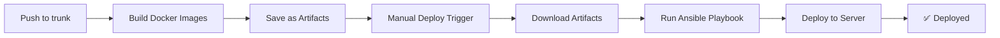
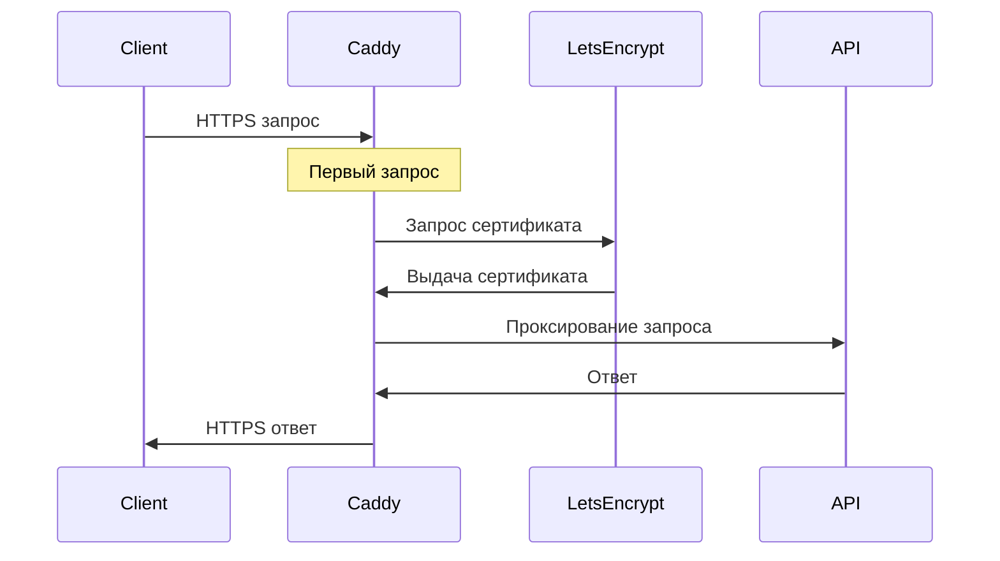

# 🚀 Руководство по деплою

Полное руководство по развертыванию проекта Academic Differences API на production сервере.

---

## 📋 Содержание

- [Требования к серверу](#-требования-к-серверу)
- [Подготовка сервера](#-подготовка-сервера)
- [Настройка GitHub Secrets](#-настройка-github-secrets)
- [Работа с Ansible Vault](#-работа-с-ansible-vault)
- [Деплой через GitHub Actions](#-деплой-через-github-actions)
- [Ручной деплой через Ansible](#-ручной-деплой-через-ansible)
- [Структура на сервере](#-структура-на-сервере)
- [Caddy и HTTPS](#-caddy-и-https)
- [Мониторинг](#-мониторинг)
- [Обновление приложения](#-обновление-приложения)
- [Смена сервера](#-смена-сервера)
- [Troubleshooting](#-troubleshooting)

---

## 💻 Требования к серверу

### Минимальные требования

| Параметр | Значение             |
| -------- | -------------------- |
| **ОС**   | Ubuntu 22.04 LTS     |
| **CPU**  | 2 cores              |
| **RAM**  | 4 GB                 |
| **Диск** | 20 GB SSD            |
| **Сеть** | Статический IP адрес |

### Рекомендуемые требования

| Параметр | Значение              |
| -------- | --------------------- |
| **ОС**   | Ubuntu 22.04 LTS      |
| **CPU**  | 4 cores               |
| **RAM**  | 8 GB                  |
| **Диск** | 40 GB SSD             |
| **Сеть** | Статический IP + IPv6 |

### Открытые порты

| Порт    | Протокол | Назначение               |
| ------- | -------- | ------------------------ |
| **22**  | TCP      | SSH доступ               |
| **80**  | TCP      | HTTP (редирект на HTTPS) |
| **443** | TCP      | HTTPS                    |
| **443** | UDP      | HTTP/3 (QUIC)            |

---

## 🔧 Подготовка сервера

### 1. Создание пользователя

```bash
# Подключитесь к серверу как root
ssh root@your-server-ip

# Создайте пользователя developer
adduser developer

# Добавьте в группу sudo
usermod -aG sudo developer

# Добавьте в группу docker (будет создана позже)
usermod -aG docker developer
```

### 2. Настройка SSH ключей

```bash
# На локальной машине сгенерируйте SSH ключ (если еще нет)
ssh-keygen -t ed25519 -C "your-email@example.com"

# Скопируйте публичный ключ на сервер
ssh-copy-id developer@your-server-ip

# Проверьте подключение
ssh developer@your-server-ip
```

### 3. Настройка DNS

Создайте A-записи для всех доменов:

| Домен                       | Тип | Значение   |
| --------------------------- | --- | ---------- |
| `api.yourdomain.com`        | A   | IP сервера |
| `bot.yourdomain.com`        | A   | IP сервера |
| `monitoring.yourdomain.com` | A   | IP сервера |

⏱️ **Важно:** Дождитесь распространения DNS записей (может занять до 24 часов).

Проверка DNS:

```bash
# Проверьте A-записи
dig api.yourdomain.com +short
dig bot.yourdomain.com +short
dig monitoring.yourdomain.com +short
```

### 4. Базовая настройка безопасности

```bash
# Обновите систему
sudo apt update && sudo apt upgrade -y

# Настройте firewall
sudo ufw allow 22/tcp
sudo ufw allow 80/tcp
sudo ufw allow 443/tcp
sudo ufw allow 443/udp
sudo ufw enable

# Проверьте статус
sudo ufw status
```

---

## 🔐 Настройка GitHub Secrets

Все секреты хранятся в **Settings → Secrets and variables → Actions** вашего GitHub репозитория.

### Обязательные секреты

| Secret                   | Описание                                 | Пример                         |
| ------------------------ | ---------------------------------------- | ------------------------------ |
| `ANSIBLE_VAULT_PASSWORD` | Пароль для расшифровки Ansible Vault     | `your-vault-password`          |
| `SSH_PRIVATE_KEY`        | Приватный SSH ключ для доступа к серверу | Содержимое `~/.ssh/id_ed25519` |
| `SERVER_HOST`            | IP адрес или домен сервера               | `123.45.67.89`                 |
| `SERVER_USER`            | Пользователь на сервере                  | `developer`                    |

### Как добавить секреты

1. **Перейдите в Settings → Secrets and variables → Actions**
2. **Нажмите "New repository secret"**
3. **Введите имя и значение секрета**
4. **Нажмите "Add secret"**

### Получение SSH ключа

```bash
# Выведите приватный ключ
cat ~/.ssh/id_ed25519

# Скопируйте весь вывод (включая BEGIN и END строки)
# Вставьте в GitHub Secret SSH_PRIVATE_KEY
```

### 🔧 Как работают переменные окружения в CI

GitHub Actions генерирует переменные для Ansible **на лету** во время деплоя. Это позволяет легко менять сервер и домены без изменения кода.

#### Генерация IMAGE_TAG

Уникальный тег образа создается из текущей даты и git hash:

```bash
IMAGE_TAG=$(date +%Y%m%d)-$(git rev-parse --short HEAD)
# Пример: 20251218-a1b2c3d
```

Этот тег используется для:

- Именования Docker образов
- Отслеживания версий в production
- Идентификации деплоя

#### Динамический inventory

IP сервера берется из GitHub Secret `VPS_IP` и записывается в `inventory.ini`:

```ini
[vps]
123.45.67.89
```

Это позволяет **менять сервер просто изменив секрет** `VPS_IP` в GitHub.

#### Передача переменных в Ansible

Переменные из GitHub Secrets передаются в Ansible через `--extra-vars`:

```bash
ansible-playbook infra/ansible/playbook.yml \
  -i inventory.ini \
  --private-key private_key.pem \
  -u ${{ secrets.ANSIBLE_USER }} \
  --extra-vars "
    image_tag='20251218-a1b2c3d'
    DOMAIN_NAME=${{ secrets.DOMAIN_NAME }}
    BOT_DOMAIN_NAME=${{ secrets.BOT_DOMAIN_NAME }}
    MONITORING_DOMAIN_NAME=${{ secrets.MONITORING_DOMAIN_NAME }}
    ALLOWED_HOSTS='${{ secrets.ALLOWED_HOSTS }}'
  " \
  --vault-password-file <(echo "$ANSIBLE_VAULT_PASSWORD")
```

Эти переменные используются в Jinja2 шаблонах ([`infra/ansible/templates/`](../infra/ansible/templates/)) для генерации конфигурационных файлов.

#### Полный список GitHub Secrets для деплоя

| Secret                   | Назначение              | Пример                         | Где используется            |
| ------------------------ | ----------------------- | ------------------------------ | --------------------------- |
| `VPS_IP`                 | IP адрес сервера        | `123.45.67.89`                 | Создание inventory.ini      |
| `SSH_PRIVATE_KEY`        | SSH ключ для доступа    | Содержимое `~/.ssh/id_ed25519` | Аутентификация на сервере   |
| `ANSIBLE_USER`           | Пользователь на сервере | `developer`                    | Параметр `-u` для Ansible   |
| `ANSIBLE_VAULT_PASSWORD` | Пароль для vault.yml    | `your-vault-password`          | Расшифровка секретов        |
| `DOMAIN_NAME`            | Домен API               | `api.example.com`              | Caddy, Django ALLOWED_HOSTS |
| `BOT_DOMAIN_NAME`        | Домен бота              | `bot.example.com`              | Caddy, BOT_API_BASE_URL     |
| `MONITORING_DOMAIN_NAME` | Домен мониторинга       | `monitoring.example.com`       | Caddy                       |
| `ALLOWED_HOSTS`          | Django ALLOWED_HOSTS    | `api.example.com`              | Django settings             |

💡 **Преимущество:** Изменение любого из этих секретов автоматически применяется при следующем деплое без изменения кода.

---

## 🔒 Работа с Ansible Vault

Ansible Vault используется для безопасного хранения секретов (пароли, токены, ключи).

### Структура Vault

Файл [`infra/ansible/vars/vault.yml`](../infra/ansible/vars/vault.yml) содержит:

```yaml
# Секреты для Django
SECRET_KEY: "django-secret-key-here"
ALLOWED_HOSTS: "api.yourdomain.com"

# Секреты для PostgreSQL
POSTGRES_USER: "academic_user"
POSTGRES_DB: "academic_db"
POSTGRES_PASSWORD: "strong-password-here"

# Учетные данные Django
DJANGO_SUPERUSER_USERNAME: "admin"
DJANGO_SUPERUSER_PASSWORD: "admin-password"
DJANGO_TELEGRAM_BOT_USERNAME: "tgbot"
DJANGO_TELEGRAM_BOT_PASSWORD: "bot-password"
DJANGO_TELEGRAM_BOT_API_TOKEN: "bot-api-token"

# Telegram Bot
TELEGRAM_BOT_TOKEN: "123456:ABC-DEF1234ghIkl-zyx57W2v1u123ew11"

# Домены
DOMAIN_NAME: "api.yourdomain.com"
BOT_DOMAIN_NAME: "bot.yourdomain.com"
MONITORING_DOMAIN_NAME: "monitoring.yourdomain.com"
```

### Создание нового Vault

```bash
cd infra/ansible

# Создайте зашифрованный файл
ansible-vault create vars/vault.yml

# Введите пароль (запомните его!)
# Откроется редактор - добавьте секреты
```

### Редактирование Vault

```bash
cd infra/ansible

# Отредактируйте зашифрованный файл
ansible-vault edit vars/vault.yml

# Введите пароль
# Внесите изменения и сохраните
```

### Просмотр Vault

```bash
cd infra/ansible

# Просмотрите содержимое
ansible-vault view vars/vault.yml

# Введите пароль
```

### Изменение пароля Vault

```bash
cd infra/ansible

# Измените пароль
ansible-vault rekey vars/vault.yml

# Введите старый пароль
# Введите новый пароль дважды
```

⚠️ **Важно:** После изменения пароля обновите `ANSIBLE_VAULT_PASSWORD` в GitHub Secrets!

### Добавление нового секрета

1. **Отредактируйте Vault:**

   ```bash
   ansible-vault edit infra/ansible/vars/vault.yml
   ```

2. **Добавьте новую переменную:**

   ```yaml
   NEW_SECRET: "new-secret-value"
   ```

3. **Используйте в шаблонах:**

   ```jinja2
   # infra/ansible/templates/.env.academic-api.prod.j2
   NEW_SECRET={{ NEW_SECRET }}
   ```

4. **Закоммитьте изменения:**
   ```bash
   git add infra/ansible/vars/vault.yml
   git add infra/ansible/templates/.env.academic-api.prod.j2
   git commit -m "feat: add new secret"
   git push
   ```

---

## 🤖 Деплой через GitHub Actions

Проект использует GitHub Actions для автоматизации деплоя.

### CI/CD Pipeline



### Workflow файлы

- [`.github/workflows/ci.yml`](../.github/workflows/ci.yml) - CI проверки и сборка образов
- [`.github/workflows/deploy.yml`](../.github/workflows/deploy.yml) - Деплой на сервер

### Процесс деплоя

#### 1. Автоматическая сборка

При каждом merge в `trunk`:

- ✅ Запускаются тесты
- ✅ Собираются Docker образы
- ✅ Образы сохраняются как артефакты

#### 2. Ручной деплой

1. **Перейдите в Actions → Deploy to VPS**
2. **Нажмите "Run workflow"**
3. **Выберите ветку (обычно `trunk`)**
4. **Нажмите "Run workflow"**

Workflow выполнит:

- Скачает артефакты с последней сборки
- Подключится к серверу через SSH
- Запустит Ansible playbook
- Развернет приложение

#### 3. Мониторинг деплоя

```bash
# Следите за логами в GitHub Actions
# Или подключитесь к серверу и проверьте логи

ssh developer@your-server-ip
cd /opt/app
docker compose logs -f
```

### Переменные окружения в CI

Workflow использует следующие переменные:

```yaml
env:
  REGISTRY: ghcr.io
  IMAGE_TAG: ${{ github.sha }}
```

---

## 🛠️ Ручной деплой через Ansible

Если нужно развернуть приложение вручную (без GitHub Actions).

### Предварительные требования

```bash
# Установите Ansible
pip install ansible

# Установите необходимые коллекции
ansible-galaxy collection install community.docker
```

### Подготовка

1. **Соберите Docker образы локально:**

   ```bash
   # API
   docker build -t academic-api:latest ./api
   docker save academic-api:latest | gzip > build/academic-api.tar.gz

   # Bot
   docker build -t telegram-bot:latest ./tgbot
   docker save telegram-bot:latest | gzip > build/telegram-bot.tar.gz
   ```

2. **Настройте inventory:**
   ```bash
   # Создайте infra/ansible/inventory.ini
   cat > infra/ansible/inventory.ini << EOF
   [vps]
   your-server-ip ansible_user=developer ansible_ssh_private_key_file=~/.ssh/id_ed25519
   EOF
   ```

### Запуск деплоя

```bash
cd infra/ansible

# Запустите playbook
ansible-playbook -i inventory.ini playbook.yml \
  --ask-vault-pass \
  -e "image_tag=latest"

# Введите пароль от Vault
```

### Что делает playbook

Playbook [`infra/ansible/playbook.yml`](../infra/ansible/playbook.yml) выполняет:

1. ✅ Устанавливает Docker и Docker Compose
2. ✅ Создает директорию `/opt/app`
3. ✅ Копирует `compose.yml` и конфигурационные файлы
4. ✅ Генерирует `.env` файлы из шаблонов
5. ✅ Копирует и загружает Docker образы
6. ✅ Запускает сервисы через Docker Compose
7. ✅ Очищает неиспользуемые образы

### Откат деплоя

```bash
cd infra/ansible

# Запустите teardown playbook
ansible-playbook -i inventory.ini teardown.yml --ask-vault-pass

# Это остановит и удалит все контейнеры
```

---

## 📁 Структура на сервере

### Директория приложения

```
/opt/app/
├── compose.yml                    # Production Docker Compose
├── Caddyfile                      # Caddy конфигурация
├── .env.pg.prod                   # PostgreSQL переменные
├── .env.academic-api.prod         # API переменные
├── .env.telegram-bot.prod         # Bot переменные
├── academic-api.tar.gz            # Docker образ API
└── telegram-bot.tar.gz            # Docker образ Bot
```

### Права доступа

```bash
# Владелец: developer:developer
# Права: 0755 (rwxr-xr-x)

ls -la /opt/app
# drwxr-xr-x developer developer /opt/app
```

### Docker volumes

```bash
# Просмотр volumes
docker volume ls

# Volumes проекта:
# - academic-difference-api_postgres_data  (БД)
# - academic-difference-api_staticfiles    (Статика Django)
# - academic-difference-api_caddy_data     (Caddy данные)
# - academic-difference-api_caddy_config   (Caddy конфиг)
# - academic-difference-api_uptime_kuma    (Uptime Kuma)
```

### Логи

```bash
# Все сервисы
docker compose logs -f

# Конкретный сервис
docker compose logs -f academic-api
docker compose logs -f telegram-bot
docker compose logs -f caddy
docker compose logs -f postgres
docker compose logs -f uptime-kuma

# Последние 100 строк
docker compose logs --tail=100 academic-api
```

---

## 🔐 Caddy и HTTPS

Caddy автоматически получает и обновляет SSL сертификаты от Let's Encrypt.

### Конфигурация Caddy

Файл [`infra/ansible/templates/Caddyfile.j2`](../infra/ansible/templates/Caddyfile.j2):

```caddyfile
{{ DOMAIN_NAME }}, www.{{ DOMAIN_NAME }} {
    encode gzip

    @static path /static/*

    handle_path /static/* {
        root * /srv/static
        file_server
    }

    handle {
        reverse_proxy academic-api:8000
    }
}

{{ BOT_DOMAIN_NAME }}, www.{{ BOT_DOMAIN_NAME }} {
    reverse_proxy telegram-bot:3000
}

{{ MONITORING_DOMAIN_NAME }}, www.{{ MONITORING_DOMAIN_NAME }} {
    reverse_proxy uptime-kuma:3001
}
```

### Как работает HTTPS



### Автоматическое обновление сертификатов

- ✅ Caddy автоматически обновляет сертификаты за 30 дней до истечения
- ✅ Не требуется ручное вмешательство
- ✅ Поддержка HTTP/3 (QUIC)

### Проверка сертификатов

```bash
# Проверьте сертификат
openssl s_client -connect api.yourdomain.com:443 -servername api.yourdomain.com

# Проверьте срок действия
echo | openssl s_client -connect api.yourdomain.com:443 2>/dev/null | openssl x509 -noout -dates
```

### Troubleshooting HTTPS

#### Сертификат не выдается

1. **Проверьте DNS:**

   ```bash
   dig api.yourdomain.com +short
   # Должен вернуть IP сервера
   ```

2. **Проверьте порты:**

   ```bash
   sudo ufw status
   # 80 и 443 должны быть открыты
   ```

3. **Проверьте логи Caddy:**

   ```bash
   docker compose logs caddy
   ```

4. **Проверьте Caddyfile:**
   ```bash
   cat /opt/app/Caddyfile
   ```

---

## 📊 Мониторинг

Проект использует **Uptime Kuma** для мониторинга доступности сервисов.

### Доступ к Uptime Kuma

1. **Откройте:** https://monitoring.yourdomain.com
2. **При первом запуске создайте аккаунт**
3. **Настройте мониторы**

### Настройка мониторов

#### API Monitor

- **Type:** HTTP(s)
- **URL:** https://api.yourdomain.com/api/v1/schema/
- **Interval:** 60 seconds
- **Retries:** 3

#### Bot Monitor

- **Type:** HTTP(s)
- **URL:** https://bot.yourdomain.com/
- **Interval:** 60 seconds
- **Retries:** 3

#### Database Monitor

- **Type:** Docker Container
- **Container:** academic-db
- **Interval:** 60 seconds

### Healthchecks

Все сервисы имеют встроенные healthchecks в [`infra/ansible/compose.yml`](../infra/ansible/compose.yml):

```yaml
healthcheck:
  test: ["CMD-SHELL", "nc -zv 127.0.0.1 8000"]
  interval: 10s
  timeout: 5s
  retries: 5
```

Проверка статуса:

```bash
docker compose ps
# Колонка STATUS покажет (healthy) или (unhealthy)
```

### Уведомления

Настройте уведомления в Uptime Kuma:

1. **Settings → Notifications**
2. **Добавьте интеграцию:**
   - Telegram
   - Email
   - Slack
   - Discord
   - Webhook

---

## 🔄 Обновление приложения

### Через GitHub Actions (рекомендуется)

1. **Внесите изменения в код**
2. **Создайте PR и смержите в trunk**
3. **Дождитесь сборки образов**
4. **Запустите Deploy workflow**

### Ручное обновление

```bash
# Подключитесь к серверу
ssh developer@your-server-ip

# Перейдите в директорию приложения
cd /opt/app

# Остановите сервисы
docker compose down

# Загрузите новые образы (если есть)
docker load -i academic-api.tar.gz
docker load -i telegram-bot.tar.gz

# Запустите сервисы
docker compose up -d

# Проверьте логи
docker compose logs -f
```

### Обновление зависимостей

#### API зависимости

```bash
# Локально обновите requirements.txt
cd api
pip install --upgrade package-name
pip freeze > requirements.txt

# Закоммитьте и задеплойте
git add requirements.txt
git commit -m "chore: update dependencies"
git push
```

#### Bot зависимости

```bash
# Локально обновите package.json
cd tgbot
npm update package-name

# Закоммитьте и задеплойте
git add package.json package-lock.json
git commit -m "chore: update dependencies"
git push
```

### Миграции базы данных

Миграции применяются автоматически при запуске контейнера API:

```yaml
command: |
  sh -c "python manage.py migrate --noinput
         ..."
```

Если нужно применить миграции вручную:

```bash
docker compose exec academic-api python manage.py migrate
```

---

## 🔄 Смена сервера

### Как перенести приложение на другой сервер

Благодаря использованию GitHub Secrets, смена сервера выполняется **без изменения кода** в репозитории.

#### 1. Подготовьте новый сервер

Следуйте инструкциям из раздела ["Подготовка сервера"](#-подготовка-сервера):

1. Установите **Ubuntu 22.04 LTS**
2. Создайте пользователя (например, `developer`)
3. Настройте SSH доступ по ключу
4. Убедитесь что открыты порты: 22, 80, 443, 443/udp

#### 2. Настройте DNS

Создайте A-записи для новых доменов (или обновите существующие):

```
api.newdomain.com        A    123.45.67.89
bot.newdomain.com        A    123.45.67.89
monitoring.newdomain.com A    123.45.67.89
```

⏱️ **Важно:** Дождитесь распространения DNS (может занять до 24 часов).

#### 3. Обновите GitHub Secrets

Перейдите в **Settings → Secrets and variables → Actions** и измените:

**Обязательные изменения:**

| Secret   | Новое значение    | Пример         |
| -------- | ----------------- | -------------- |
| `VPS_IP` | IP нового сервера | `123.45.67.89` |

**Опциональные изменения (если изменились):**

| Secret                   | Когда менять                     | Пример                     |
| ------------------------ | -------------------------------- | -------------------------- |
| `DOMAIN_NAME`            | Если изменился домен API         | `api.newdomain.com`        |
| `BOT_DOMAIN_NAME`        | Если изменился домен бота        | `bot.newdomain.com`        |
| `MONITORING_DOMAIN_NAME` | Если изменился домен мониторинга | `monitoring.newdomain.com` |
| `ALLOWED_HOSTS`          | Если изменились домены           | `api.newdomain.com`        |
| `ANSIBLE_USER`           | Если другой пользователь         | `ubuntu`                   |
| `SSH_PRIVATE_KEY`        | Если другой SSH ключ             | Новый приватный ключ       |

#### 4. Запустите деплой

1. Перейдите в **Actions → Deploy to Production**
2. Нажмите **Run workflow**
3. Выберите ветку `trunk`
4. Нажмите **Run workflow**

GitHub Actions автоматически:

- ✅ Создаст `inventory.ini` с новым IP из `VPS_IP`
- ✅ Подключится к новому серверу
- ✅ Установит Docker и зависимости
- ✅ Развернет все сервисы
- ✅ Настроит Caddy с новыми доменами
- ✅ Получит SSL сертификаты от Let's Encrypt

#### 5. Проверьте работу

```bash
# Проверьте DNS
dig api.newdomain.com +short
# Должен вернуть новый IP

# Проверьте HTTPS
curl -I https://api.newdomain.com
# Должен вернуть 200 OK

# Подключитесь к серверу
ssh developer@123.45.67.89

# Проверьте статус сервисов
cd /opt/app
docker compose ps
# Все сервисы должны быть healthy
```

#### 6. Перенесите данные (если нужно)

Если на старом сервере есть важные данные:

```bash
# На старом сервере: создайте дамп БД
docker compose exec postgres pg_dump -U academic_user academic_db > backup.sql

# Скопируйте на новый сервер
scp backup.sql developer@new-server-ip:/tmp/

# На новом сервере: восстановите БД
docker compose exec -T postgres psql -U academic_user academic_db < /tmp/backup.sql
```

#### 7. Остановите старый сервер

После проверки работы нового сервера:

```bash
# На старом сервере
cd /opt/app
docker compose down -v
```

### Что происходит автоматически

При изменении `VPS_IP` в GitHub Secrets:

✅ **Inventory генерируется динамически** - Ansible подключается к новому IP
✅ **Переменные передаются через --extra-vars** - Новые домены применяются автоматически
✅ **Caddy настраивается с новыми доменами** - SSL сертификаты получаются автоматически
✅ **Все сервисы разворачиваются** - Полная установка на чистом сервере

### Важные замечания

⚠️ **DNS:** Убедитесь что DNS записи обновлены и распространились
⚠️ **SSL:** Caddy автоматически получит сертификаты при первом HTTPS запросе
⚠️ **Данные:** Миграции применятся автоматически, но данные БД нужно перенести вручную
⚠️ **Старый сервер:** Не забудьте остановить сервисы на старом сервере после переноса
⚠️ **Мониторинг:** Обновите настройки Uptime Kuma для проверки новых доменов

### Откат на старый сервер

Если что-то пошло не так:

1. Измените `VPS_IP` обратно на старый IP
2. Запустите деплой снова
3. Ansible развернет приложение на старом сервере

💡 **Совет:** Держите старый сервер работающим несколько дней после переноса на случай необходимости отката.

---

## 🔧 Troubleshooting

### Проблемы с деплоем

#### GitHub Actions не может подключиться к серверу

```bash
# Проверьте SSH ключ в GitHub Secrets
# Проверьте, что ключ добавлен на сервер

ssh developer@your-server-ip
cat ~/.ssh/authorized_keys
```

#### Ansible Vault ошибка

```bash
# Проверьте пароль в GitHub Secrets
# Убедитесь, что ANSIBLE_VAULT_PASSWORD правильный

# Локально проверьте:
ansible-vault view infra/ansible/vars/vault.yml
```

#### Docker образы не загружаются

```bash
# Проверьте размер артефактов в GitHub Actions
# Убедитесь, что build/ директория создана

# На сервере проверьте:
ls -lh /opt/app/*.tar.gz
```

### Проблемы с сервисами

#### Контейнер не запускается

```bash
# Проверьте логи
docker compose logs service-name

# Проверьте статус
docker compose ps

# Проверьте healthcheck
docker inspect container-name | grep -A 10 Health
```

#### База данных недоступна

```bash
# Проверьте статус PostgreSQL
docker compose ps postgres

# Проверьте логи
docker compose logs postgres

# Подключитесь к БД
docker compose exec postgres psql -U academic_user -d academic_db
```

#### API возвращает 502

```bash
# Проверьте, что API запущен
docker compose ps academic-api

# Проверьте логи API
docker compose logs academic-api

# Проверьте логи Caddy
docker compose logs caddy

# Проверьте healthcheck
docker compose exec academic-api nc -zv 127.0.0.1 8000
```

### Проблемы с HTTPS

#### Сертификат не выдается

```bash
# Проверьте DNS
dig api.yourdomain.com +short

# Проверьте порты
sudo netstat -tulpn | grep -E ':(80|443)'

# Проверьте логи Caddy
docker compose logs caddy | grep -i error

# Проверьте Caddyfile
cat /opt/app/Caddyfile
```

#### Mixed content warnings

```bash
# Убедитесь, что все ссылки используют HTTPS
# Проверьте BOT_API_BASE_URL в .env файлах

cat /opt/app/.env.academic-api.prod | grep BOT_API_BASE_URL
# Должно быть: BOT_API_BASE_URL=https://bot.yourdomain.com
```

### Проблемы с производительностью

#### Высокая нагрузка на CPU

```bash
# Проверьте использование ресурсов
docker stats

# Проверьте логи на ошибки
docker compose logs | grep -i error

# Увеличьте количество workers в gunicorn
# Отредактируйте infra/ansible/compose.yml:
# gunicorn --workers=5 --bind=0.0.0.0:8000 core.wsgi:application
```

#### Медленные запросы к БД

```bash
# Подключитесь к БД
docker compose exec postgres psql -U academic_user -d academic_db

# Проверьте медленные запросы
SELECT * FROM pg_stat_statements ORDER BY total_time DESC LIMIT 10;

# Проверьте индексы
\di
```

### Восстановление после сбоя

#### Полная переустановка

```bash
# Остановите и удалите все
docker compose down -v

# Удалите директорию
sudo rm -rf /opt/app

# Запустите деплой заново
# через GitHub Actions или Ansible
```

#### Восстановление из бэкапа

```bash
# Остановите сервисы
docker compose down

# Восстановите volume БД
docker run --rm -v academic-difference-api_postgres_data:/data \
  -v $(pwd):/backup alpine \
  tar xzf /backup/postgres-backup.tar.gz -C /data

# Запустите сервисы
docker compose up -d
```

---

## 📞 Поддержка

Если возникли проблемы:

1. ✅ Проверьте логи: `docker compose logs -f`
2. ✅ Проверьте статус: `docker compose ps`
3. ✅ Проверьте healthchecks: `docker inspect container-name`
4. ✅ Создайте Issue в репозитории с описанием проблемы

---

## 🔗 Полезные команды

```bash
# Подключение к серверу
ssh developer@your-server-ip

# Переход в директорию приложения
cd /opt/app

# Просмотр логов
docker compose logs -f

# Перезапуск сервиса
docker compose restart service-name

# Остановка всех сервисов
docker compose down

# Запуск всех сервисов
docker compose up -d

# Проверка статуса
docker compose ps

# Очистка неиспользуемых ресурсов
docker system prune -a

# Бэкап базы данных
docker compose exec postgres pg_dump -U academic_user academic_db > backup.sql
```
