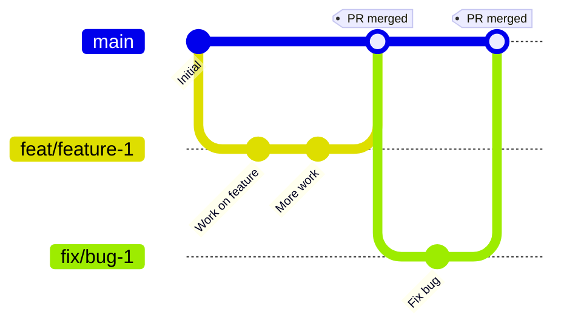
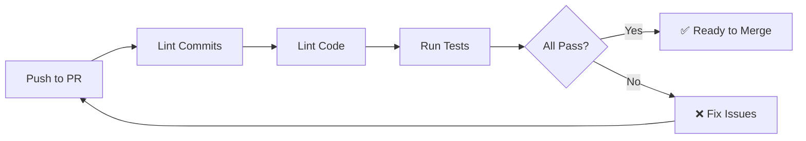

# 💻 Руководство для разработчиков

Полное руководство по локальной разработке проекта Academic Differences API.

---

## 📋 Содержание

- [Требования](#-требования)
- [Первоначальная настройка](#-первоначальная-настройка)
- [Работа с зависимостями](#-работа-с-зависимостями)
- [Работа с миграциями Django](#-работа-с-миграциями-django)
- [Обновление API клиента бота](#-обновление-api-клиента-бота)
- [Пересборка Docker контейнеров](#-пересборка-docker-контейнеров)
- [Workflow разработки](#-workflow-разработки)
- [Правила именования веток](#-правила-именования-веток)
- [Pull Request процесс](#-pull-request-процесс)
- [Conventional Commits](#-conventional-commits)
- [Pre-commit хуки](#-pre-commit-хуки)
- [Линтеры и форматтеры](#-линтеры-и-форматтеры)
- [Тестирование](#-тестирование)
- [Обновление документации](#-обновление-документации)
- [Troubleshooting](#-troubleshooting)

---

## 🔧 Требования

### Обязательные инструменты

| Инструмент         | Версия | Назначение               |
| ------------------ | ------ | ------------------------ |
| **Docker**         | 20.10+ | Контейнеризация сервисов |
| **Docker Compose** | v2.0+  | Оркестрация контейнеров  |
| **Node.js**        | 20+    | Разработка Telegram бота |
| **Python**         | 3.12+  | Локальная разработка API |
| **Git**            | 2.30+  | Контроль версий          |

### Рекомендуемые инструменты

- **VS Code** или **Cursor** - IDE с AI ассистентом
- **Postman** или **Insomnia** - Тестирование API
- **DBeaver** или **pgAdmin** - Работа с PostgreSQL

---

## 🚀 Первоначальная настройка

### 1. Клонирование репозитория

```bash
git clone <repository-url>
cd academic-difference-api
```

### 2. Создание файла окружения

```bash
cp .env.example .env
```

Отредактируйте [`.env`](.env) при необходимости. Для локальной разработки значения по умолчанию подходят.

### 3. Запуск проекта

```bash
docker compose up --build -d
```

Эта команда:

- Соберет Docker образы для API и бота
- Запустит PostgreSQL, API, и Telegram бота
- Применит миграции базы данных
- Создаст суперпользователя и пользователя для бота

### 4. Проверка работы

```bash
# Проверка статуса контейнеров
docker compose ps

# Логи всех сервисов
docker compose logs -f

# Логи конкретного сервиса
docker compose logs -f academic-api
```

**Доступные URL:**

- API: http://localhost:8000
- Swagger UI: http://localhost:8000/api/v1/schema/swagger-ui/
- ReDoc: http://localhost:8000/api/v1/schema/redoc/
- Django Admin: http://localhost:8000/admin/

**Учетные данные по умолчанию:**

- Админ: `root` / `root`
- Бот: `tgbot` / `tgbot`

### 5. Установка pre-commit хуков

```bash
cd api
python -m venv venv
source venv/bin/activate  # На Windows: venv\Scripts\activate
pip install -r requirements.txt
pre-commit install --hook-type pre-commit --hook-type commit-msg
```

---

## 📦 Работа с зависимостями

### Python зависимости (API)

#### Добавление новой зависимости

1. **Отредактируйте [`api/requirements.txt`](../api/requirements.txt):**

   ```txt
   # Добавьте новый пакет
   new-package==1.0.0
   ```

2. **Создайте виртуальное окружение и установите зависимости:**

   ```bash
   cd api
   python -m venv venv
   source venv/bin/activate
   pip install -r requirements.txt
   ```

3. **Если нужны миграции - создайте их (см. раздел ниже)**

4. **Пересоберите Docker контейнер:**
   ```bash
   cd ..
   docker compose down -v
   docker compose up --build -d
   ```

#### Обновление зависимости

```bash
# В requirements.txt измените версию
old-package==1.0.0  →  old-package==2.0.0

# Повторите шаги 2-4 из раздела выше
```

### Node.js зависимости (Telegram Bot)

#### Добавление новой зависимости

1. **Установите пакет через npm:**

   ```bash
   cd tgbot

   # Production зависимость
   npm install package-name

   # Dev зависимость
   npm install --save-dev package-name
   ```

2. **Пересоберите Docker контейнер:**
   ```bash
   cd ..
   docker compose down -v
   docker compose up --build -d
   ```

#### Обновление зависимости

```bash
cd tgbot

# Обновить конкретный пакет
npm update package-name

# Или установить конкретную версию
npm install package-name@latest

# Пересоберите контейнер
cd ..
docker compose down -v
docker compose up --build -d
```

---

## 🗄️ Работа с миграциями Django

### ⚠️ ВАЖНО: Миграции создаются ЛОКАЛЬНО, НЕ в контейнере!

Это критически важно для корректной работы миграций и избежания проблем с правами доступа.

### Создание новых миграций

1. **Создайте виртуальное окружение (если еще не создано):**

   ```bash
   cd api
   python -m venv venv
   source venv/bin/activate  # На Windows: venv\Scripts\activate
   ```

2. **Установите зависимости:**

   ```bash
   pip install -r requirements.txt
   ```

3. **Внесите изменения в модели** в [`api/api/models.py`](../api/api/models.py)

4. **Создайте миграции:**

   ```bash
   python manage.py makemigrations
   ```

5. **Проверьте созданные миграции** в [`api/api/migrations/`](../api/api/migrations/)

6. **Деактивируйте виртуальное окружение:**

   ```bash
   deactivate
   ```

7. **Пересоберите Docker контейнер для применения миграций:**
   ```bash
   cd ..
   docker compose down -v
   docker compose up --build -d
   ```

### Применение миграций

Миграции применяются автоматически при запуске контейнера через команду в [`compose.yml`](../compose.yml):

```yaml
command: |
  sh -c "python manage.py migrate --noinput
         ..."
```

### Откат миграций

```bash
# Откатить последнюю миграцию
docker compose exec academic-api python manage.py migrate api <previous_migration_name>

# Откатить все миграции приложения
docker compose exec academic-api python manage.py migrate api zero
```

### Просмотр статуса миграций

```bash
docker compose exec academic-api python manage.py showmigrations
```

---

## 🔄 Обновление API клиента бота

Когда вы изменяете API (добавляете/изменяете endpoints), необходимо обновить автогенерируемый клиент в боте.

### Когда нужно обновлять клиент?

- ✅ Добавлены новые endpoints
- ✅ Изменены существующие endpoints
- ✅ Изменены модели данных (serializers)
- ✅ Изменены параметры запросов/ответов

### Процесс обновления

1. **Убедитесь, что API запущен:**

   ```bash
   docker compose ps academic-api
   # Должен быть в статусе "Up"
   ```

2. **Перейдите в директорию бота:**

   ```bash
   cd tgbot
   ```

3. **Сгенерируйте клиент:**

   ```bash
   npm run gen:client
   ```

   Эта команда:

   - Подключится к http://localhost:8000/api/v1/schema/
   - Скачает OpenAPI спецификацию
   - Сгенерирует TypeScript клиент в [`tgbot/src/generated/django-client/`](../tgbot/src/generated/django-client/)

4. **Проверьте изменения:**

   ```bash
   git status
   # Должны появиться изменения в src/generated/
   ```

5. **Обновите код бота** для использования новых endpoints

6. **Пересоберите контейнер бота:**
   ```bash
   cd ..
   docker compose restart telegram-bot
   ```

### Пример использования клиента

```typescript
// tgbot/src/scenes.ts
import { client } from "./generated/django-client";

// Получение списка студентов
const students = await client.GET("/api/v1/students/");

// Создание нового расхождения
const difference = await client.POST("/api/v1/academic-differences/", {
  body: {
    student: 1,
    subject: 2,
    // ...
  },
});
```

---

## 🐳 Пересборка Docker контейнеров

### Полная пересборка (рекомендуется)

Используйте эту команду после изменения зависимостей или миграций:

```bash
docker compose down -v && docker compose up --build -d
```

**Что делает эта команда:**

- `docker compose down -v` - Останавливает и удаляет контейнеры + volumes (включая БД)
- `docker compose up --build -d` - Пересобирает образы и запускает контейнеры в фоне

⚠️ **Внимание:** Флаг `-v` удаляет volumes, включая данные БД. Все данные будут потеряны!

### Пересборка без удаления данных

Если нужно сохранить данные БД:

```bash
docker compose down
docker compose up --build -d
```

### Пересборка конкретного сервиса

```bash
# Только API
docker compose up --build -d academic-api

# Только бот
docker compose up --build -d telegram-bot
```

### Очистка Docker кэша

Если возникают проблемы со сборкой:

```bash
# Удалить все неиспользуемые образы
docker image prune -a

# Удалить все неиспользуемые volumes
docker volume prune

# Полная очистка (осторожно!)
docker system prune -a --volumes
```

---

## 🌳 Workflow разработки

Проект использует **Trunk-Based Development** - стратегию разработки с одной основной веткой (`trunk`).

### Основные принципы



1. **Нельзя коммитить напрямую в `trunk`** - только через Pull Request
2. **Короткоживущие ветки** - feature ветки живут 1-3 дня максимум
3. **Частые интеграции** - мержим в trunk как можно чаще
4. **CI проверки обязательны** - PR не может быть смержен без прохождения CI

### Процесс разработки

#### 1. Создание feature ветки

```bash
# Обновите trunk
git checkout trunk
git pull origin trunk

# Создайте новую ветку
git checkout -b feat/add-student-export
```

#### 2. Разработка

```bash
# Делайте изменения
# Коммитьте часто с понятными сообщениями

git add .
git commit -m "feat: add student export endpoint"
```

#### 3. Отправка в remote

```bash
git push origin feat/add-student-export
```

#### 4. Создание Pull Request

1. Перейдите на GitHub
2. Создайте PR из вашей ветки в `trunk`
3. Заполните описание PR
4. Дождитесь прохождения CI проверок
5. Запросите ревью у коллег

#### 5. После merge

```bash
# Переключитесь на trunk
git checkout trunk
git pull origin trunk

# Удалите локальную feature ветку
git branch -d feat/add-student-export
```

⚠️ **Важно:** После rebase PR в GitHub всегда удаляйте локальную ветку и создавайте новую, если нужно продолжить работу.

---

## 🏷️ Правила именования веток

Используйте префиксы для категоризации веток:

| Префикс     | Назначение                   | Пример                        |
| ----------- | ---------------------------- | ----------------------------- |
| `feat/`     | Новая функциональность       | `feat/add-student-filter`     |
| `fix/`      | Исправление бага             | `fix/student-validation`      |
| `docs/`     | Изменения в документации     | `docs/update-readme`          |
| `refactor/` | Рефакторинг кода             | `refactor/simplify-api-views` |
| `test/`     | Добавление/изменение тестов  | `test/add-student-tests`      |
| `chore/`    | Рутинные задачи              | `chore/update-dependencies`   |
| `perf/`     | Улучшение производительности | `perf/optimize-queries`       |
| `ci/`       | Изменения в CI/CD            | `ci/add-docker-cache`         |

### Правила именования

✅ **Хорошо:**

- `feat/add-student-export`
- `fix/telegram-bot-crash`
- `docs/update-deployment-guide`

❌ **Плохо:**

- `my-changes`
- `fix`
- `update`
- `feat/add_student_export` (используйте дефисы, не подчеркивания)

---

## 🔀 Pull Request процесс

### Создание PR

1. **Убедитесь, что ветка актуальна:**

   ```bash
   git checkout trunk
   git pull origin trunk
   git checkout feat/my-feature
   git rebase trunk
   ```

2. **Отправьте изменения:**

   ```bash
   git push origin feat/my-feature
   ```

3. **Создайте PR на GitHub** с описанием:

   ```markdown
   ## Описание

   Краткое описание изменений

   ## Изменения

   - Добавлен endpoint для экспорта студентов
   - Обновлена документация API

   ## Тестирование

   - [ ] Локальные тесты пройдены
   - [ ] Проверено в Swagger UI
   - [ ] Обновлен клиент бота

   ## Связанные задачи

   Closes #123
   ```

### CI проверки

При создании PR автоматически запускаются проверки:



**Проверки включают:**

- ✅ Conventional Commits формат
- ✅ Python линтинг (pylint, black, isort)
- ✅ TypeScript линтинг (eslint, prettier)
- ✅ Тесты API (pytest)
- ✅ Сборка Docker образов

### Ревью кода

**Для автора PR:**

- Отвечайте на комментарии ревьюеров
- Вносите запрошенные изменения
- Помечайте resolved комментарии

**Для ревьюера:**

- Проверяйте логику и архитектуру
- Обращайте внимание на безопасность
- Проверяйте тесты и документацию
- Будьте конструктивны в комментариях

### Merge

После одобрения и прохождения всех проверок:

1. **Squash and merge** (рекомендуется) - объединяет все коммиты в один
2. Удалите ветку после merge
3. Обновите локальный trunk:
   ```bash
   git checkout trunk
   git pull origin trunk
   ```

---

## 📝 Conventional Commits

Проект использует [Conventional Commits](https://www.conventionalcommits.org/) для стандартизации сообщений коммитов.

### Формат

```
<type>(<scope>): <subject>

<body>

<footer>
```

### Типы коммитов

| Тип        | Описание                 | Пример                                   |
| ---------- | ------------------------ | ---------------------------------------- |
| `feat`     | Новая функциональность   | `feat(api): add student export endpoint` |
| `fix`      | Исправление бага         | `fix(bot): handle empty response`        |
| `docs`     | Изменения в документации | `docs: update deployment guide`          |
| `style`    | Форматирование кода      | `style(api): format with black`          |
| `refactor` | Рефакторинг              | `refactor(api): simplify views`          |
| `test`     | Тесты                    | `test(api): add student tests`           |
| `chore`    | Рутинные задачи          | `chore: update dependencies`             |
| `perf`     | Производительность       | `perf(api): optimize queries`            |
| `ci`       | CI/CD                    | `ci: add docker cache`                   |
| `build`    | Сборка                   | `build: update dockerfile`               |
| `revert`   | Откат изменений          | `revert: feat(api): add export`          |

### Примеры

✅ **Хорошо:**

```bash
feat(api): add student export to CSV

Implement CSV export functionality for students.
Includes filtering by department and date range.

Closes #123
```

```bash
fix(bot): handle telegram api timeout

Add retry logic for telegram API calls.
Timeout increased to 30 seconds.
```

```bash
docs: update development guide

- Add section about migrations
- Update docker commands
- Fix typos
```

❌ **Плохо:**

```bash
update code
```

```bash
fixed bug
```

```bash
WIP
```

### Использование commitizen

Для помощи в создании правильных коммитов используйте `commitizen`:

```bash
# Вместо git commit
cz commit

# Интерактивный выбор типа, scope, описания
```

---

## 🪝 Pre-commit хуки

Pre-commit хуки автоматически проверяют код перед каждым коммитом.

### Установка

```bash
cd api
python -m venv venv
source venv/bin/activate
pip install -r requirements.txt
pre-commit install --hook-type pre-commit --hook-type commit-msg
```

### Настроенные хуки

Конфигурация в [`api/.pre-commit-config.yaml`](../api/.pre-commit-config.yaml):

1. **trailing-whitespace** - Удаляет пробелы в конце строк
2. **end-of-file-fixer** - Добавляет пустую строку в конец файла
3. **check-yaml** - Проверяет синтаксис YAML
4. **check-added-large-files** - Предотвращает коммит больших файлов
5. **black** - Форматирует Python код
6. **isort** - Сортирует импорты
7. **pylint** - Проверяет качество кода
8. **commitizen** - Проверяет формат коммита

### Запуск вручную

```bash
# Запустить все хуки на всех файлах
pre-commit run --all-files

# Запустить конкретный хук
pre-commit run black --all-files

# Обновить хуки до последних версий
pre-commit autoupdate
```

### Пропуск хуков (не рекомендуется)

```bash
# Пропустить pre-commit хуки
git commit --no-verify -m "feat: emergency fix"

# Пропустить только commit-msg хук
git commit --no-verify -m "WIP"
```

⚠️ **Внимание:** Используйте `--no-verify` только в крайних случаях. CI все равно проверит код.

---

## 🔍 Линтеры и форматтеры

### Python (API)

#### Black - Форматтер кода

```bash
cd api
black .

# Проверка без изменений
black --check .
```

Конфигурация в [`api/pyproject.toml`](../api/pyproject.toml):

```toml
[tool.black]
line-length = 120
target-version = ['py312']
```

#### isort - Сортировка импортов

```bash
cd api
isort .

# Проверка без изменений
isort --check-only .
```

Конфигурация в [`api/pyproject.toml`](../api/pyproject.toml):

```toml
[tool.isort]
profile = "black"
line_length = 120
```

#### pylint - Линтер

```bash
cd api
pylint api/

# С отчетом
pylint --output-format=colorized api/
```

Конфигурация в [`api/.pylintrc`](../api/.pylintrc)

### TypeScript (Bot)

#### ESLint - Линтер

```bash
cd tgbot
npm run lint:eslint

# Автоисправление
npm run lint:eslint -- --fix
```

Конфигурация в [`tgbot/eslint.config.mjs`](../tgbot/eslint.config.mjs)

#### Prettier - Форматтер

```bash
cd tgbot
npm run lint:prettier

# Автоисправление
npx prettier --write ./src
```

Конфигурация в [`tgbot/prettier.config.mjs`](../tgbot/prettier.config.mjs)

#### TypeScript - Проверка типов

```bash
cd tgbot
npm run lint:ts
```

### Запуск всех проверок

```bash
# API
cd api
black . && isort . && pylint api/ && pytest

# Bot
cd tgbot
npm run lint
```

---

## 🧪 Тестирование

### API тесты (pytest)

#### Запуск тестов

```bash
cd api

# Все тесты
pytest

# С покрытием
pytest --cov

# Конкретный файл
pytest api/tests.py

# Конкретный тест
pytest api/tests.py::TestStudentAPI::test_create_student

# С подробным выводом
pytest -v

# Остановка на первой ошибке
pytest -x
```

#### Структура тестов

Тесты находятся в [`api/api/tests.py`](../api/api/tests.py):

```python
from django.test import TestCase
from rest_framework.test import APITestCase
from .models import Student
from .factories import StudentFactory

class StudentAPITest(APITestCase):
    def setUp(self):
        self.student = StudentFactory()

    def test_list_students(self):
        response = self.client.get('/api/v1/students/')
        self.assertEqual(response.status_code, 200)

    def test_create_student(self):
        data = {'name': 'Test', 'email': 'test@example.com'}
        response = self.client.post('/api/v1/students/', data)
        self.assertEqual(response.status_code, 201)
```

#### Покрытие кода

Конфигурация в [`api/.coveragerc`](../api/.coveragerc):

```bash
# Генерация HTML отчета
pytest --cov --cov-report=html

# Открыть отчет
open htmlcov/index.html
```

#### Фабрики (factory-boy)

Используйте фабрики для создания тестовых данных:

```python
import factory
from .models import Student

class StudentFactory(factory.django.DjangoModelFactory):
    class Meta:
        model = Student

    name = factory.Faker('name')
    email = factory.Faker('email')
```

### Bot тесты (Jest)

```bash
cd tgbot

# Все тесты
npm test

# С покрытием
npm test -- --coverage

# Watch mode
npm test -- --watch
```

Конфигурация в [`tgbot/jest.config.ts`](../tgbot/jest.config.ts)

---

## 📚 Обновление документации

### Рекомендация: Используйте AI

Для обновления документации рекомендуется использовать AI ассистенты:

- **Cursor** - IDE с встроенным AI
- **GitHub Copilot** - AI помощник для кода
- **ChatGPT** - Для генерации документации

### Процесс обновления с AI

1. **Опишите изменения AI:**

   ```
   Я добавил новый endpoint для экспорта студентов в CSV.
   Обнови документацию в docs/DEVELOPMENT.md
   ```

2. **Проверьте сгенерированную документацию**

3. **Внесите правки при необходимости**

4. **Закоммитьте изменения:**
   ```bash
   git add docs/
   git commit -m "docs: update development guide with export endpoint"
   ```

### Что документировать

- ✅ Новые endpoints API
- ✅ Изменения в процессе разработки
- ✅ Новые зависимости
- ✅ Изменения в конфигурации
- ✅ Troubleshooting для новых проблем

### Структура документации

```
docs/
├── DEVELOPMENT.md    # Этот файл - для разработчиков
├── DEPLOYMENT.md     # Деплой и инфраструктура
└── ARCHITECTURE.md   # Архитектура системы
```

---

## 🔧 Troubleshooting

### Проблемы с Docker

#### Контейнеры не запускаются

```bash
# Проверьте логи
docker compose logs

# Проверьте статус
docker compose ps

# Пересоберите с нуля
docker compose down -v
docker compose up --build -d
```

#### Порты заняты

```bash
# Найдите процесс на порту 8000
lsof -i :8000

# Убейте процесс
kill -9 <PID>

# Или измените порт в compose.yml
```

#### Проблемы с volumes

```bash
# Удалите все volumes
docker compose down -v

# Удалите конкретный volume
docker volume rm academic-difference-api_postgres_data
```

### Проблемы с миграциями

#### Миграции не применяются

```bash
# Проверьте статус миграций
docker compose exec academic-api python manage.py showmigrations

# Примените миграции вручную
docker compose exec academic-api python manage.py migrate

# Проверьте логи
docker compose logs academic-api
```

#### Конфликт миграций

```bash
# Откатите миграции
docker compose exec academic-api python manage.py migrate api zero

# Удалите конфликтующие файлы миграций
rm api/api/migrations/000X_*.py

# Создайте миграции заново
cd api
source venv/bin/activate
python manage.py makemigrations
```

### Проблемы с зависимостями

#### Python зависимости не устанавливаются

```bash
# Очистите pip cache
pip cache purge

# Переустановите зависимости
pip install --no-cache-dir -r requirements.txt

# Обновите pip
pip install --upgrade pip
```

#### Node.js зависимости не устанавливаются

```bash
# Удалите node_modules и package-lock.json
rm -rf node_modules package-lock.json

# Переустановите
npm install

# Или используйте npm ci для чистой установки
npm ci
```

### Проблемы с API клиентом бота

#### Клиент не генерируется

```bash
# Проверьте, что API запущен
curl http://localhost:8000/api/v1/schema/

# Проверьте версию @hey-api/openapi-ts
npm list @hey-api/openapi-ts

# Переустановите пакет
npm install --save-dev @hey-api/openapi-ts@latest

# Попробуйте сгенерировать снова
npm run gen:client
```

#### Ошибки типов TypeScript

```bash
# Проверьте типы
npm run lint:ts

# Пересоберите проект
npm run build

# Проверьте tsconfig.json
cat tsconfig.json
```

### Проблемы с pre-commit

#### Хуки не запускаются

```bash
# Переустановите
```
