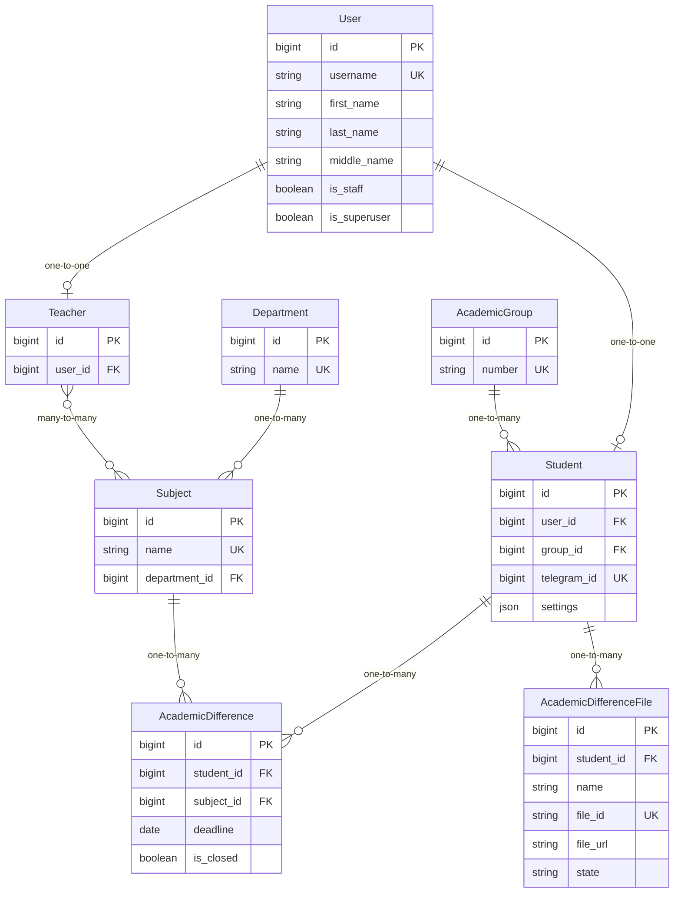
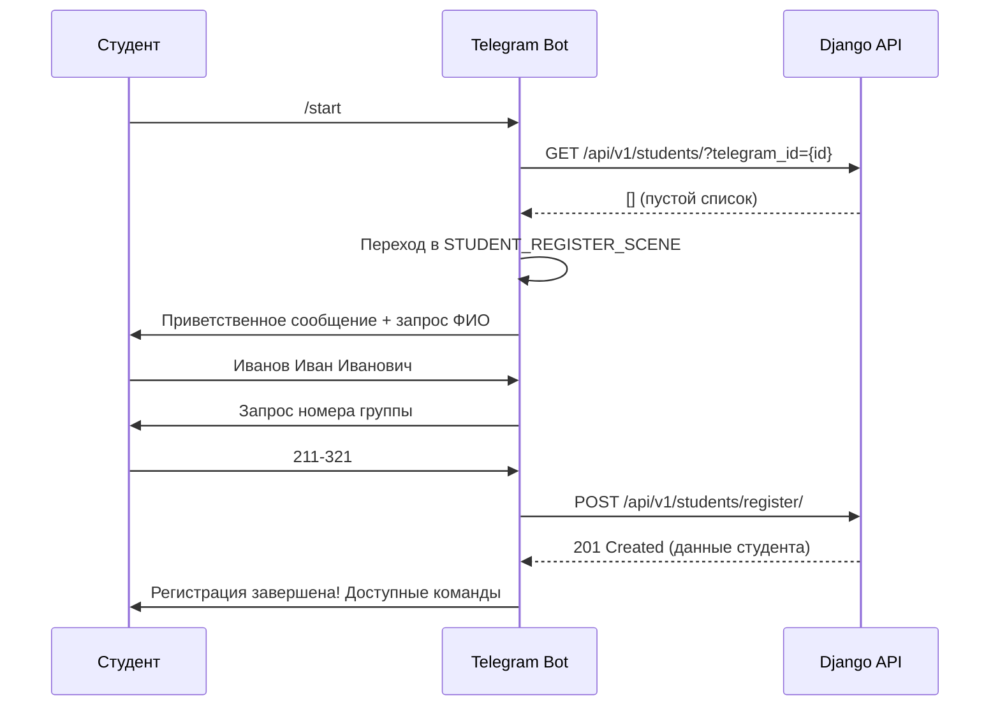
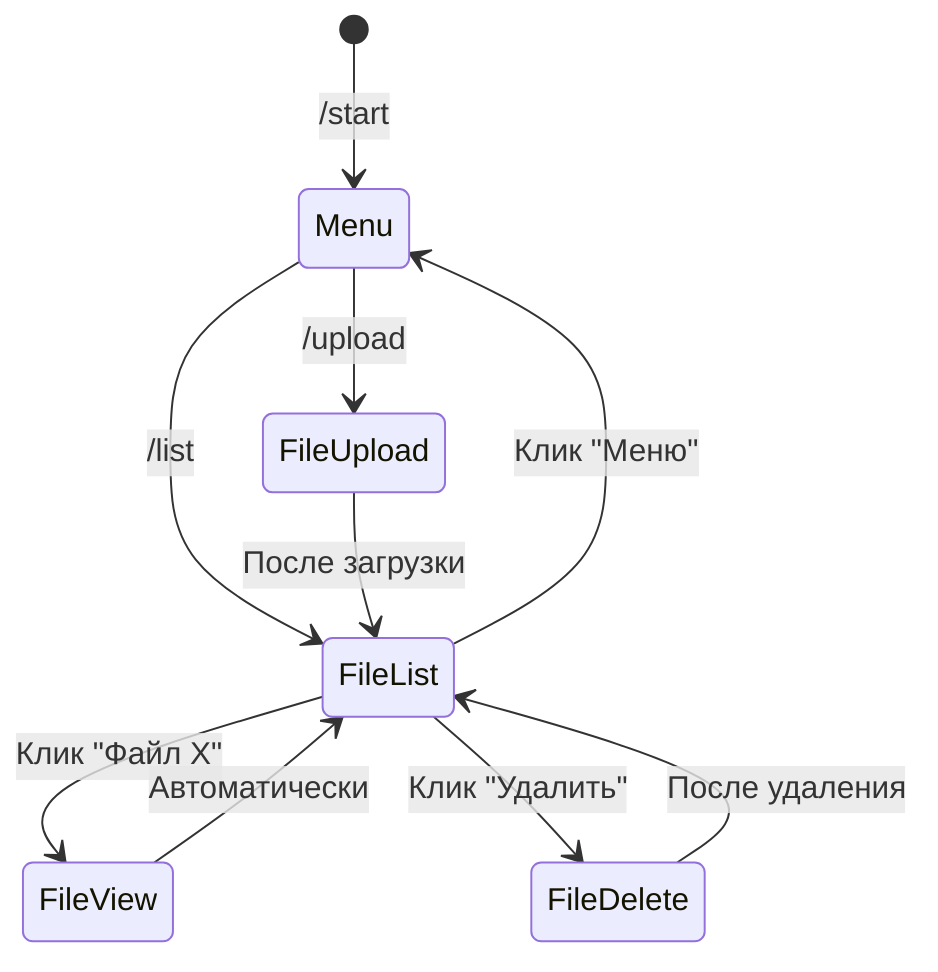

# Доменная область проекта

## 📋 Содержание

- [Что такое Academic Difference (РУП)](#что-такое-academic-difference-руп)
- [Доменная модель](#доменная-модель)
- [Связи между сущностями](#связи-между-сущностями)
- [Бизнес-логика](#бизнес-логика)
- [API Endpoints](#api-endpoints)
- [Workflow пользователя в боте](#workflow-пользователя-в-боте)
- [Роли и права доступа](#роли-и-права-доступа)
- [История изменений моделей](#история-изменений-моделей)
- [Технические особенности](#технические-особенности)

## 🎓 Что такое Academic Difference (РУП)

**Academic Difference** (Расхождение Учебного Плана, сокращенно **РУП**) — это академическая задолженность студента по определенному предмету. Система предназначена для управления и отслеживания этих задолженностей в университете.

### Основное назначение системы

Система позволяет:

- Студентам загружать файлы с расхождениями учебных планов через Telegram бота
- Администраторам проверять и утверждать загруженные файлы
- Отслеживать академические задолженности студентов
- Управлять дедлайнами и статусами закрытия задолженностей

---

## 🗂️ Доменная модель

### User (Пользователь)

**Файл**: [`api/api/models.py`](../api/api/models.py:49-57)

**Назначение**: Кастомная модель пользователя Django без email

**Поля**:

| Поле           | Тип            | Описание                      | Обязательное        |
| -------------- | -------------- | ----------------------------- | ------------------- |
| `id`           | BigAutoField   | Уникальный идентификатор      | ✅                  |
| `username`     | CharField(150) | Имя пользователя (уникальное) | ✅                  |
| `password`     | CharField(128) | Хэшированный пароль           | ✅                  |
| `first_name`   | CharField(150) | Имя                           | ❌                  |
| `last_name`    | CharField(150) | Фамилия                       | ❌                  |
| `middle_name`  | CharField(150) | Отчество                      | ❌                  |
| `is_staff`     | BooleanField   | Флаг администратора           | ✅ (default: False) |
| `is_superuser` | BooleanField   | Флаг суперпользователя        | ✅ (default: False) |
| `is_active`    | BooleanField   | Активен ли пользователь       | ✅ (default: True)  |
| `date_joined`  | DateTimeField  | Дата регистрации              | ✅ (auto)           |
| `last_login`   | DateTimeField  | Последний вход                | ❌                  |

**Особенности**:

- Использует [`CustomUserManager`](../api/api/models.py:10-46) для создания пользователей без email
- `USERNAME_FIELD = "username"`
- `REQUIRED_FIELDS = []` (не требует email при создании суперпользователя)

---

### AcademicGroup (Академическая группа)

**Файл**: [`api/api/models.py`](../api/api/models.py:74-84)

**Назначение**: Учебная группа студентов

**Поля**:

| Поле         | Тип               | Описание                  | Обязательное |
| ------------ | ----------------- | ------------------------- | ------------ |
| `id`         | BigAutoField      | Уникальный идентификатор  | ✅           |
| `number`     | CharField(50)     | Номер группы (уникальный) | ✅           |
| `created_at` | DateTimeField     | Дата создания             | ✅ (auto)    |
| `updated_at` | DateTimeField     | Дата обновления           | ✅ (auto)    |
| `history`    | HistoricalRecords | История изменений         | ✅ (auto)    |

**Формат номера группы**: `XXX-XXX` (например, "211-321")

**Verbose names**: "Группа" / "Группы"

---

### Student (Студент)

**Файл**: [`api/api/models.py`](../api/api/models.py:87-115)

**Назначение**: Профиль студента, связывающий пользователя с учебной группой

**Поля**:

| Поле          | Тип                       | Описание                 | Обязательное     |
| ------------- | ------------------------- | ------------------------ | ---------------- |
| `id`          | BigAutoField              | Уникальный идентификатор | ✅               |
| `user`        | OneToOneField(User)       | Связь с пользователем    | ✅ (PROTECT)     |
| `group`       | ForeignKey(AcademicGroup) | Связь с группой          | ✅ (PROTECT)     |
| `telegram_id` | BigIntegerField           | Уникальный Telegram ID   | ✅ (unique)      |
| `settings`    | JSONField                 | Настройки студента       | ✅ (default: {}) |
| `created_at`  | DateTimeField             | Дата создания            | ✅ (auto)        |
| `updated_at`  | DateTimeField             | Дата обновления          | ✅ (auto)        |
| `history`     | HistoricalRecords         | История изменений        | ✅ (auto)        |

**Валидация settings**:

```python
{
    "notifications": bool  # Обязательное поле
}
```

**Verbose names**: "Студент" / "Студенты"

---

### Department (Кафедра)

**Файл**: [`api/api/models.py`](../api/api/models.py:118-128)

**Назначение**: Университетская кафедра

**Поля**:

| Поле         | Тип               | Описание                      | Обязательное |
| ------------ | ----------------- | ----------------------------- | ------------ |
| `id`         | BigAutoField      | Уникальный идентификатор      | ✅           |
| `name`       | CharField(255)    | Название кафедры (уникальное) | ✅           |
| `created_at` | DateTimeField     | Дата создания                 | ✅ (auto)    |
| `updated_at` | DateTimeField     | Дата обновления               | ✅ (auto)    |
| `history`    | HistoricalRecords | История изменений             | ✅ (auto)    |

**Verbose names**: "Кафедра" / "Кафедры"

---

### Subject (Предмет)

**Файл**: [`api/api/models.py`](../api/api/models.py:131-143)

**Назначение**: Учебный предмет

**Поля**:

| Поле         | Тип                    | Описание                       | Обязательное |
| ------------ | ---------------------- | ------------------------------ | ------------ |
| `id`         | BigAutoField           | Уникальный идентификатор       | ✅           |
| `name`       | CharField(255)         | Название предмета (уникальное) | ✅           |
| `department` | ForeignKey(Department) | Связь с кафедрой               | ✅ (PROTECT) |
| `created_at` | DateTimeField          | Дата создания                  | ✅ (auto)    |
| `updated_at` | DateTimeField          | Дата обновления                | ✅ (auto)    |
| `history`    | HistoricalRecords      | История изменений              | ✅ (auto)    |

**Verbose names**: "Предмет" / "Предметы"

---

### Teacher (Преподаватель)

**Файл**: [`api/api/models.py`](../api/api/models.py:146-158)

**Назначение**: Профиль преподавателя

**Поля**:

| Поле         | Тип                      | Описание                 | Обязательное |
| ------------ | ------------------------ | ------------------------ | ------------ |
| `id`         | BigAutoField             | Уникальный идентификатор | ✅           |
| `user`       | OneToOneField(User)      | Связь с пользователем    | ✅ (PROTECT) |
| `subjects`   | ManyToManyField(Subject) | Преподаваемые предметы   | ❌           |
| `created_at` | DateTimeField            | Дата создания            | ✅ (auto)    |
| `updated_at` | DateTimeField            | Дата обновления          | ✅ (auto)    |
| `history`    | HistoricalRecords        | История изменений        | ✅ (auto)    |

**Особенности**: Преподаватель может вести несколько предметов (ManyToMany)

**Verbose names**: "Преподаватель" / "Преподаватели"

---

### AcademicDifference (РУП)

**Файл**: [`api/api/models.py`](../api/api/models.py:161-177)

**Назначение**: Академическая задолженность студента по предмету

**Поля**:

| Поле         | Тип                 | Описание                    | Обязательное        |
| ------------ | ------------------- | --------------------------- | ------------------- |
| `id`         | BigAutoField        | Уникальный идентификатор    | ✅                  |
| `student`    | ForeignKey(Student) | Связь со студентом          | ✅ (PROTECT)        |
| `subject`    | ForeignKey(Subject) | Связь с предметом           | ✅ (PROTECT)        |
| `deadline`   | DateField           | Дата дедлайна               | ✅                  |
| `is_closed`  | BooleanField        | Флаг закрытия задолженности | ✅ (default: False) |
| `created_at` | DateTimeField       | Дата создания               | ✅ (auto)           |
| `updated_at` | DateTimeField       | Дата обновления             | ✅ (auto)           |
| `history`    | HistoricalRecords   | История изменений           | ✅ (auto)           |

**Verbose names**: "РУП" / "РУПы"

**Бизнес-правила**:

- `is_closed=False` - задолженность активна
- `is_closed=True` - задолженность закрыта (студент сдал)

---

### AcademicDifferenceFile (Файл с РУП)

**Файл**: [`api/api/models.py`](../api/api/models.py:180-213)

**Назначение**: Файл с расхождениями, загруженный студентом через Telegram бота

**Поля**:

| Поле         | Тип                 | Описание                    | Обязательное               |
| ------------ | ------------------- | --------------------------- | -------------------------- |
| `id`         | BigAutoField        | Уникальный идентификатор    | ✅                         |
| `student`    | ForeignKey(Student) | Связь со студентом          | ✅ (CASCADE)               |
| `name`       | CharField(255)      | Название файла              | ✅ (default: "Не указано") |
| `file_id`    | CharField(255)      | Уникальный Telegram File ID | ✅ (unique)                |
| `file_url`   | URLField            | URL файла (не используется) | ✅                         |
| `state`      | CharField(20)       | Статус обработки            | ✅ (default: REVIEW)       |
| `created_at` | DateTimeField       | Дата создания               | ✅ (auto)                  |
| `updated_at` | DateTimeField       | Дата обновления             | ✅ (auto)                  |
| `history`    | HistoricalRecords   | История изменений           | ✅ (auto)                  |

**Статусы (state)**:

| Значение       | Отображение     | Описание                        |
| -------------- | --------------- | ------------------------------- |
| `APPROVED`     | ✅ Подтверждён  | Файл проверен и принят          |
| `NOT_ACCEPTED` | ❌ Не принят    | Файл отклонен                   |
| `REVIEW`       | ⏳ Рассмотрение | Ожидает проверки (по умолчанию) |

**Особенности**:

- Сортировка по умолчанию: `-created_at` (новые первыми)
- Связь с Student через CASCADE (при удалении студента удаляются его файлы)
- Файлы со статусом `APPROVED` нельзя удалить через бота
- **Важно**: Поле `file_url` не используется в системе. URL для скачивания генерируется динамически на основе `file_id` через Express-прокси: `{BOT_API_BASE_URL}/files/{file_id}/`
- Прокси скрывает токен бота и обеспечивает безопасный доступ к файлам (см. [`tgbot/src/main.ts`](../tgbot/src/main.ts:65-90))

**Verbose names**: "Файл с РУП" / "Файлы с РУПами"

---

## 🔗 Связи между сущностями

### ER-диаграмма



### Типы связей

**OneToOne (один-к-одному)**:

- `User` ↔ `Student` (PROTECT)
- `User` ↔ `Teacher` (PROTECT)

**ForeignKey (один-ко-многим)**:

- `AcademicGroup` → `Student` (PROTECT)
- `Department` → `Subject` (PROTECT)
- `Subject` → `AcademicDifference` (PROTECT)
- `Student` → `AcademicDifference` (PROTECT)
- `Student` → `AcademicDifferenceFile` (CASCADE)

**ManyToMany (многие-ко-многим)**:

- `Teacher` ↔ `Subject`

### Политики удаления

**PROTECT** - запрещает удаление, если есть связанные объекты:

- Нельзя удалить User, если есть Student или Teacher
- Нельзя удалить AcademicGroup, если есть студенты
- Нельзя удалить Subject, если есть РУПы

**CASCADE** - удаляет связанные объекты:

- При удалении Student удаляются все его AcademicDifferenceFile

---

## 💼 Бизнес-логика

### Регистрация студента

**Endpoint**: `POST /api/v1/students/register/`

**Файл**: [`api/api/views.py`](../api/api/views.py:78-127)

**Процесс**:

1. Студент отправляет данные через Telegram бота:

   ```json
   {
     "telegram_id": 123456789,
     "full_name": "Иванов Иван Иванович",
     "group_number": "211-321"
   }
   ```

2. Система валидирует данные:

   - ФИО должно содержать минимум 2 части (фамилия и имя)
   - Номер группы должен быть в формате XXX-XXX
   - telegram_id должен быть уникальным

3. Система создает:

   - `User` с username = `tguser-{telegram_id}` и случайным паролем
   - `AcademicGroup` (если не существует)
   - `Student` с привязкой к User, Group и telegram_id

4. Возвращает данные студента

**Бизнес-правила**:

- Один telegram_id может быть зарегистрирован только один раз
- Username генерируется автоматически
- Пароль генерируется случайно (студент не использует его напрямую)

---

### Загрузка файла РУП

**Endpoint**: `POST /api/v1/academic-difference-file/`

**Файл**: [`api/api/views.py`](../api/api/views.py:172-177)

**Процесс**:

1. Студент отправляет файл в Telegram бота
2. Бот валидирует формат файла:

   - `.xls` (application/vnd.ms-excel)
   - `.xlsx` (application/vnd.openxmlformats-officedocument.spreadsheetml.sheet)
   - `.png` (image/png)
   - `.jpg`, `.jpeg` (image/jpeg)

3. Бот создает запись через API:

   ```json
   {
     "student": 1,
     "name": "РУП_2024.xlsx",
     "file_id": "BQACAgIAAxkBAAIC...",
     "file_url": "https://placeholder.url",
     "state": "REVIEW"
   }
   ```

4. Файл сохраняется в Telegram с уникальным `file_id`
5. URL для скачивания генерируется автоматически в админке: `{BOT_API_BASE_URL}/files/{file_id}/`
6. Express-сервер бота ([`tgbot/src/main.ts:65-90`](../tgbot/src/main.ts:65-90)) проксирует запросы к файлам, скрывая токен бота
7. Администратор может изменить статус на `APPROVED` или `NOT_ACCEPTED`

**Бизнес-правила**:

- Файл создается со статусом `REVIEW` (⏳ Рассмотрение)
- Файлы со статусом `APPROVED` нельзя удалить через бота
- Файлы со статусом `REVIEW` или `NOT_ACCEPTED` можно удалить

---

### Удаление файла

**Endpoint**: `DELETE /api/v1/academic-difference-file/{id}/`

**Файл**: [`tgbot/src/scenes.ts`](../tgbot/src/scenes.ts:396-437)

**Процесс**:

1. Студент выбирает файл для удаления
2. Бот проверяет статус файла
3. Если статус `APPROVED` - отказ в удалении
4. Если статус `REVIEW` или `NOT_ACCEPTED` - удаление разрешено

**Бизнес-правила**:

- ✅ Можно удалить: `REVIEW`, `NOT_ACCEPTED`
- ❌ Нельзя удалить: `APPROVED`

---

### Управление РУПами

**Endpoints**: CRUD для `/api/v1/academic-differences/`

**Файл**: [`api/api/views.py`](../api/api/views.py:151-156)

**Операции**:

- Создание РУПа (администратором)
- Просмотр списка РУПов с фильтрацией
- Обновление статуса `is_closed` (закрытие задолженности)
- Экспорт незакрытых РУПов (в админке)

**Фильтры**:

- По студенту (username, фамилия)
- По предмету
- По дедлайну (точное совпадение, больше/меньше)
- По статусу закрытия (`is_closed`)

**Бизнес-правила**:

- РУП создается со статусом `is_closed=False`
- Администратор может закрыть РУП, установив `is_closed=True`
- Экспорт в админке показывает только незакрытые РУПы

---

## 🔌 API Endpoints

### Полный список endpoints

**Файл**: [`api/api/urls.py`](../api/api/urls.py:1-21)

#### Users

- `GET /api/v1/users/` - список пользователей
- `POST /api/v1/users/` - создание пользователя
- `GET /api/v1/users/{id}/` - детали пользователя
- `PUT /api/v1/users/{id}/` - обновление пользователя
- `PATCH /api/v1/users/{id}/` - частичное обновление
- `DELETE /api/v1/users/{id}/` - удаление пользователя

**Фильтры**: `username`, `first_name`, `last_name`, `middle_name`, `is_staff`

#### Students

- `GET /api/v1/students/` - список студентов
- `POST /api/v1/students/` - создание студента
- `POST /api/v1/students/register/` - **регистрация через бота**
- `GET /api/v1/students/{id}/` - детали студента
- `PUT /api/v1/students/{id}/` - обновление студента
- `PATCH /api/v1/students/{id}/` - частичное обновление
- `DELETE /api/v1/students/{id}/` - удаление студента

**Фильтры**: `user__username`, `user__last_name`, `group__number`, `telegram_id`

#### Groups

- `GET /api/v1/groups/` - список групп
- `POST /api/v1/groups/` - создание группы
- `GET /api/v1/groups/{id}/` - детали группы
- `PUT /api/v1/groups/{id}/` - обновление группы
- `PATCH /api/v1/groups/{id}/` - частичное обновление
- `DELETE /api/v1/groups/{id}/` - удаление группы

**Фильтры**: `number`

#### Departments

- `GET /api/v1/departments/` - список кафедр
- `POST /api/v1/departments/` - создание кафедры
- `GET /api/v1/departments/{id}/` - детали кафедры
- `PUT /api/v1/departments/{id}/` - обновление кафедры
- `PATCH /api/v1/departments/{id}/` - частичное обновление
- `DELETE /api/v1/departments/{id}/` - удаление кафедры

**Фильтры**: `name`

#### Subjects

- `GET /api/v1/subjects/` - список предметов
- `POST /api/v1/subjects/` - создание предмета
- `GET /api/v1/subjects/{id}/` - детали предмета
- `PUT /api/v1/subjects/{id}/` - обновление предмета
- `PATCH /api/v1/subjects/{id}/` - частичное обновление
- `DELETE /api/v1/subjects/{id}/` - удаление предмета

**Фильтры**: `name`, `department__name`

#### Teachers

- `GET /api/v1/teachers/` - список преподавателей
- `POST /api/v1/teachers/` - создание преподавателя
- `GET /api/v1/teachers/{id}/` - детали преподавателя
- `PUT /api/v1/teachers/{id}/` - обновление преподавателя
- `PATCH /api/v1/teachers/{id}/` - частичное обновление
- `DELETE /api/v1/teachers/{id}/` - удаление преподавателя

**Фильтры**: `user__username`, `user__last_name`, `subjects__name`

#### Academic Differences (РУПы)

- `GET /api/v1/academic-differences/` - список РУПов
- `POST /api/v1/academic-differences/` - создание РУПа
- `GET /api/v1/academic-differences/{id}/` - детали РУПа
- `PUT /api/v1/academic-differences/{id}/` - обновление РУПа
- `PATCH /api/v1/academic-differences/{id}/` - частичное обновление
- `DELETE /api/v1/academic-differences/{id}/` - удаление РУПа

**Фильтры**: `student__user__username`, `student__user__last_name`, `subject__name`, `deadline`, `is_closed`

#### Academic Difference Files

- `GET /api/v1/academic-difference-file/` - список файлов
- `POST /api/v1/academic-difference-file/` - создание файла
- `GET /api/v1/academic-difference-file/{id}/` - детали файла
- `PUT /api/v1/academic-difference-file/{id}/` - обновление файла
- `PATCH /api/v1/academic-difference-file/{id}/` - частичное обновление
- `DELETE /api/v1/academic-difference-file/{id}/` - удаление файла

**Фильтры**: `student__id`, `state`, `created_at` (диапазон дат)

#### Дополнительные endpoints

- `GET /health/` - health check
- `GET /api/v1/schema/` - OpenAPI схема
- `GET /api/v1/schema/swagger-ui/` - Swagger UI
- `GET /api/v1/schema/redoc/` - ReDoc документация

---

## 🤖 Workflow пользователя в боте

### Первый запуск (регистрация)

**Файл**: [`tgbot/src/scenes.ts`](../tgbot/src/scenes.ts:127-218)



**Шаги**:

1. Приветственное сообщение с описанием бота
2. Запрос ФИО (формат: Фамилия Имя Отчество)
3. Валидация ФИО (минимум 2 части)
4. Запрос номера группы (формат: XXX-XXX)
5. Валидация номера группы
6. Отправка данных в API
7. Сообщение об успешной регистрации

---

### Главное меню

**Файл**: [`tgbot/src/scenes.ts`](../tgbot/src/scenes.ts:60-93)



**Доступные команды**:

- `/start` - главное меню
- `/upload` - загрузка файла РУП
- `/list` - просмотр загруженных файлов

---

### Загрузка файла

**Файл**: [`tgbot/src/scenes.ts`](../tgbot/src/scenes.ts:220-290)

**Процесс**:

1. Бот запрашивает файл
2. Студент отправляет документ или фото
3. Валидация формата (xls, xlsx, png, jpeg, jpg)
4. Создание записи в API со статусом `REVIEW`
5. Переход в FILE_LIST_SCENE

**Поддерживаемые форматы**:

- `application/vnd.ms-excel` (.xls)
- `application/vnd.openxmlformats-officedocument.spreadsheetml.sheet` (.xlsx)
- `image/png` (.png)
- `image/jpeg` (.jpg, .jpeg)

---

### Просмотр списка файлов

**Файл**: [`tgbot/src/scenes.ts`](../tgbot/src/scenes.ts:309-355)

**Функционал**:

- Пагинация (кнопки "Назад" / "Дальше")
- Для каждого файла:
  - Кнопка "Файл {id}, {статус}" → просмотр файла
  - Кнопка "Удалить" → удаление файла
- Кнопка "Меню" → возврат в главное меню

**Статусы файлов**:

- ✅ Подтверждён (APPROVED)
- ❌ Не принят (NOT_ACCEPTED)
- ⏳ На рассмотрении (REVIEW)

---

### Просмотр файла

**Файл**: [`tgbot/src/scenes.ts`](../tgbot/src/scenes.ts:363-388)

**Процесс**:

1. Получение данных файла из API
2. Отправка файла студенту через `ctx.replyWithDocument(file_id)`
3. Автоматический возврат к списку файлов

---

### Удаление файла

**Файл**: [`tgbot/src/scenes.ts`](../tgbot/src/scenes.ts:396-437)

\*\*Проц

есс\*\*:

1. Студент выбирает файл для удаления из списка
2. Бот проверяет статус файла через API
3. Если статус `APPROVED` - показывает сообщение об отказе
4. Если статус `REVIEW` или `NOT_ACCEPTED` - удаляет файл
5. Возврат к списку файлов

**Ограничения**:

- ✅ Можно удалить: файлы со статусом `REVIEW` или `NOT_ACCEPTED`
- ❌ Нельзя удалить: файлы со статусом `APPROVED`

---

## 👥 Роли и права доступа

### Роли в системе

#### Студент (Student)

**Доступ**: Только через Telegram бота

**Возможности**:

- Регистрация в системе через бота
- Загрузка файлов с РУП
- Просмотр своих загруженных файлов
- Удаление файлов (кроме подтвержденных)
- Просмотр статусов файлов

**Ограничения**:

- Нет доступа к Django Admin
- Нет доступа к API напрямую
- Не может видеть файлы других студентов
- Не может изменять статусы файлов

#### Администратор (is_staff=True)

**Доступ**: Django Admin панель

**Возможности**:

- Полный CRUD для всех моделей
- Изменение статусов файлов (`REVIEW` → `APPROVED`/`NOT_ACCEPTED`)
- Управление РУПами (создание, редактирование, закрытие)
- Экспорт данных (CSV, XLS, XLSX)
- Просмотр истории изменений всех моделей
- Скачивание файлов студентов через админку

**Особенности**:

- Может создавать и редактировать пользователей
- Может назначать права другим пользователям
- Видит все данные в системе

#### Суперпользователь (is_superuser=True)

**Доступ**: Django Admin панель + полные права

**Возможности**:

- Все возможности администратора
- Управление правами пользователей
- Доступ ко всем настройкам Django
- Может удалять любые объекты

#### Telegram Bot User

**Доступ**: API через токен аутентификации

**Возможности**:

- Создание студентов через `/api/v1/students/register/`
- Создание файлов через `/api/v1/academic-difference-file/`
- Чтение данных студентов
- Удаление файлов студентов

**Ограничения**:

- Нет доступа к Django Admin
- Ограниченный набор API endpoints

### Аутентификация

**Django Admin**:

- Стандартная аутентификация Django (username + password)
- Сессии

**API**:

- Token Authentication (DRF)
- Токен передается в заголовке: `Authorization: Token {token}`

**Telegram Bot**:

- Аутентификация через `telegram_id`
- Middleware проверяет наличие студента в БД

---

## 📜 История изменений моделей

Все основные модели используют [`django-simple-history`](https://django-simple-history.readthedocs.io/) для отслеживания изменений.

### Модели с историей

- [`AcademicGroup`](../api/api/models.py:74-84)
- [`Student`](../api/api/models.py:87-115)
- [`Department`](../api/api/models.py:118-128)
- [`Subject`](../api/api/models.py:131-143)
- [`Teacher`](../api/api/models.py:146-158)
- [`AcademicDifference`](../api/api/models.py:161-177)
- [`AcademicDifferenceFile`](../api/api/models.py:180-213)

### Что отслеживается

Для каждого изменения записывается:

- **Тип операции**: создание (+), изменение (~), удаление (-)
- **Дата и время** изменения
- **Пользователь**, совершивший изменение
- **Все поля** объекта на момент изменения

### Доступ к истории

**В Django Admin**:

- Кнопка "History" на странице объекта
- Показывает все изменения в хронологическом порядке
- Можно сравнивать версии

**Через код**:

```python
# Получить всю историю объекта
student = Student.objects.get(id=1)
history = student.history.all()

# Получить последнее изменение
last_change = student.history.first()

# Фильтрация по типу изменения
created = student.history.filter(history_type='+')
updated = student.history.filter(history_type='~')
deleted = student.history.filter(history_type='-')
```

### Таблицы истории

Для каждой модели создается отдельная таблица:

- `api_historicalacademicgroup`
- `api_historicalstudent`
- `api_historicaldepartment`
- `api_historicalsubject`
- `api_historicalteacher`
- `api_historicalacademicdifference`
- `api_historicalacademicdifferencefile`

---

## ⚙️ Технические особенности

### Валидация данных

#### Student.settings

**Файл**: [`api/api/models.py`](../api/api/models.py:100-108)

```python
def clean(self):
    if not isinstance(self.settings, dict):
        raise ValidationError("Settings must be a dictionary")
    if "notifications" not in self.settings:
        raise ValidationError("Settings must contain 'notifications' key")
    if not isinstance(self.settings["notifications"], bool):
        raise ValidationError("'notifications' must be a boolean")
```

#### AcademicGroup.number

**Формат**: `XXX-XXX` (3 цифры, дефис, 3 цифры)

**Пример**: `211-321`, `101-101`

#### Student Registration

**Файл**: [`api/api/views.py`](../api/api/views.py:78-127)

- ФИО должно содержать минимум 2 части (фамилия и имя)
- Номер группы должен соответствовать формату `XXX-XXX`
- `telegram_id` должен быть уникальным

### Сериализация

**Файл**: [`api/api/serializers.py`](../api/api/serializers.py)

Все модели имеют соответствующие сериализаторы DRF:

- `UserSerializer`
- `AcademicGroupSerializer`
- `StudentSerializer`
- `DepartmentSerializer`
- `SubjectSerializer`
- `TeacherSerializer`
- `AcademicDifferenceSerializer`
- `AcademicDifferenceFileSerializer`

**Особенности**:

- Вложенные сериализаторы для связанных объектов
- Валидация на уровне сериализатора
- Поддержка создания связанных объектов

### Фильтрация

**Используется**: [`django-filter`](https://django-filter.readthedocs.io/)

**Файл**: [`api/api/views.py`](../api/api/views.py)

Каждый ViewSet имеет настроенные фильтры:

```python
# Пример для StudentViewSet
filterset_fields = {
    "user__username": ["exact", "icontains"],
    "user__last_name": ["exact", "icontains"],
    "group__number": ["exact"],
    "telegram_id": ["exact"],
}
```

### Пагинация

**Тип**: `PageNumberPagination`

**Настройки**:

- `page_size`: 10 (по умолчанию)
- `page_size_query_param`: "page_size"
- `max_page_size`: 100

### Экспорт данных

**Используется**: [`django-import-export`](https://django-import-export.readthedocs.io/)

**Форматы**: CSV, XLS, XLSX

**Особенности**:

- Экспорт доступен в Django Admin
- Для `AcademicDifference` экспортируются только незакрытые РУПы
- Поддержка кастомных ресурсов для форматирования данных

### Проксирование файлов

**Файл**: [`tgbot/src/main.ts`](../tgbot/src/main.ts:65-90)

**Endpoint**: `GET /files/:id`

**Процесс**:

1. Получение `file_id` из параметров запроса
2. Запрос файла из Telegram API через `bot.telegram.getFileLink(id)`
3. Скачивание файла с Telegram серверов
4. Проксирование файла клиенту с правильными заголовками

**Преимущества**:

- Скрывает токен бота от клиентов
- Единая точка доступа к файлам
- Автоматическое определение MIME-типа
- Поддержка имен файлов

### Миграции

**Директория**: [`api/api/migrations/`](../api/api/migrations/)

**Основные миграции**:

- `0001_initial.py` - создание базовых моделей
- `0002_alter_user_managers.py` - обновление менеджера User
- `0003_academicdifferencefile_and_more.py` - добавление модели файлов
- `0004_alter_academicdifference_options_and_more.py` - обновление опций моделей

### Тестирование

**Файл**: [`api/api/tests.py`](../api/api/tests.py)

**Конфигурация**: [`api/pytest.ini`](../api/pytest.ini)

**Покрытие**: Настроено через [`api/.coveragerc`](../api/.coveragerc)

---

## 📚 Связанная документация

- [Архитектура проекта](ARCHITECTURE.md)
- [Руководство по разработке](DEVELOPMENT.md)
- [Инструкция по развертыванию](DEPLOYMENT.md)
- [README](../README.md)

---

**Последнее обновление**: 2025-12-18
